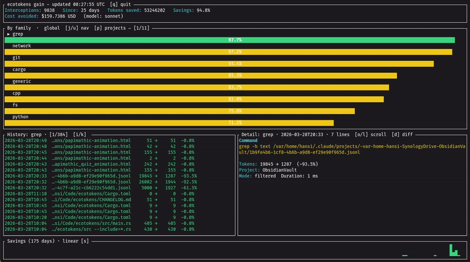

<p align="center">
  
</p>

<p align="center">
  <a href="https://github.com/hansipie/ecotokens/actions/workflows/ci.yml"></a>
  <a href="https://crates.io/crates/ecotokens"></a>
  <a href="LICENSE"></a>
</p>

<p align="right">
  <a href="https://www.producthunt.com/products/ecotokens?embed=true&amp;utm_source=badge-featured&amp;utm_medium=badge&amp;utm_campaign=badge-ecotokens" target="_blank" rel="noopener noreferrer"></a>
</p>
<br>

Token-saving companion for [Claude Code](https://claude.ai/code), [Gemini CLI](https://github.com/google-gemini/gemini-cli), [Qwen Code](https://github.com/QwenLM/qwen-code), and [Pi](https://pi.dev). Built on a *"set it and forget it!"* philosophy: one install command, zero configuration, and ecotokens works automatically from there — intercepting tool outputs before they reach the model, filtering the noise, and recording how many tokens you saved.

<p align="center">
  
</p>

## Features highlight

| Feature | Details |
|---------|---------|
| **PreToolUse hook** | Intercepts every shell (`Bash`) command before its output reaches the model — filters, compresses, and records savings |
| **PostToolUse hook** *(Claude Code, Gemini CLI, Qwen Code)* | Intercepts native tool results (`Read`/`read_file`, `Grep`/`search_file_content`, `Glob`/`list_directory`) — outline-based compression for source files, grep trimming, glob denoising |
| **Gain dashboard** | Interactive TUI — token savings by command family or project, sparkline, diff view, history log |
| **Multi-agent support** | Works with Claude Code, Gemini CLI, Qwen Code, and Pi out of the box |
| **Precision guarantees** | Errors, failures, and stack traces are never removed; secrets are redacted before filtering |
| **Code intelligence** | BM25 + semantic search, symbol lookup, call graph tracing, near-duplicate detection |
| **AI summarization** *(optional)* | Large outputs compressed by a local Ollama model instead of being truncated |
| **Word abbreviations** *(optional)* | Replace common words with shorter forms (`function`→`fn`, `configuration`→`config`, …) in narrative text, and nudge the model to do the same via a SessionStart instruction |
| **Zero config** | One `ecotokens install` command — works automatically from there |

## How it works

ecotokens installs hooks that intercept tool outputs before they reach the model. Two interception points are supported:

**PreToolUse / BeforeTool** — fires before every shell (`Bash`) command:

1. Runs the command and captures its output
2. Applies a family-specific filter (git, cargo, python, …)
3. Optionally summarizes large outputs via a local AI model (Ollama)
4. Returns the compressed output to the model
5. Records the before/after token counts in a local metrics store

**PostToolUse / AfterTool** *(Claude Code, Gemini CLI, Qwen Code)* — fires after native file-tool calls:

1. Intercepts the tool result before it enters the context window
2. Applies a specialized filter (outline for source files, grep result trimming, glob path denoising)
3. Returns the compressed result to the model
4. Records the savings under the `native_read`, `grep`, or `fs` family

Claude Code uses the `PreToolUse` + `PostToolUse` hooks (`~/.claude/settings.json`). Gemini CLI uses the `BeforeTool` + `AfterTool` hooks (`~/.gemini/settings.json`). Qwen Code uses the `PreToolUse` + `PostToolUse` hooks (`~/.qwen/settings.json`). Pi uses a TypeScript extension (`~/.pi/agent/extensions/ecotokens.ts`) that intercepts `tool_call` (bash pre-exec) and `tool_result` (read/grep/find/ls post-exec) events in-process.

For a focused view of the runtime path, see [`docs/hook-filter-metrics-flow.md`](docs/hook-filter-metrics-flow.md).

The result: the model sees clean, concise output — and you keep your context window.

## Quick install

```bash
cargo install --git https://github.com/hansipie/ecotokens
```

For exact token counting (tiktoken cl100k_base instead of the character heuristic):

```bash
cargo install --git https://github.com/hansipie/ecotokens --features exact-tokens
```

## Build from source

```bash
git clone https://github.com/hansipie/ecotokens.git
cd ecotokens
cargo build --release
./target/release/ecotokens --help
```

To install the locally built binary into Cargo's bin directory:

```bash
cargo install --path .
```

With exact token counting enabled:

```bash
cargo install --path . --features exact-tokens
```

## Installation

### Claude Code

```bash
cargo install --path .
ecotokens install
```

### Gemini CLI

Requires [Gemini CLI](https://github.com/google-gemini/gemini-cli) ≥ 0.1.0.

```bash
cargo install --path .
ecotokens install --target gemini
```

This writes `BeforeTool` and `AfterTool` hook entries into `~/.gemini/settings.json`. The `AfterTool` hook intercepts `read_file`, `search_file_content`, and `list_directory` results.

### Qwen Code

Requires [Qwen Code](https://github.com/QwenLM/qwen-code).

```bash
cargo install --path .
ecotokens install --target qwen
```

This writes `PreToolUse` and `PostToolUse` hook entries into `~/.qwen/settings.json`. The `PostToolUse` hook intercepts `read_file`, `search_files`, and `list_dir` results.

### Pi

Requires [Pi](https://pi.dev) (`@mariozechner/pi-coding-agent` ≥ 0.62.0).

```bash
cargo install --path .
ecotokens install --target pi
```

This writes a TypeScript extension to `~/.pi/agent/extensions/ecotokens.ts`. Pi auto-discovers it on next startup (or `/reload` inside an active session). The extension intercepts bash commands before execution and filters native tool results (`read`, `grep`, `find`, `ls`) after execution.

### All targets at once

```bash
ecotokens install --target all
```

`--target all` covers Claude Code, Gemini CLI, Qwen Code, and Pi in a single command.

### With exact token counting

By default, token counts use a fast character heuristic (`chars × 0.25`, ~80-85% accuracy). Enable exact counting via [tiktoken](https://github.com/openai/tiktoken) (cl100k_base encoding):

```bash
cargo install --path . --features exact-tokens
```

This has no effect on filtering behavior — only the token counts recorded in metrics are more precise.

### With AI summarization

Enable AI-powered output compression via Ollama at install time:

```bash
ecotokens install --ai-summary                          # use default model (llama3.2:3b)
ecotokens install --ai-summary-model qwen2.5:3b         # specify model (implies --ai-summary)
```

This writes `ai_summary_enabled` and `ai_summary_model` to `~/.config/ecotokens/config.json`. Ollama must be running and the model must be pulled (`ollama pull llama3.2:3b`).

### Uninstall

```bash
ecotokens uninstall                    # Claude Code
ecotokens uninstall --target gemini    # Gemini CLI
ecotokens uninstall --target qwen      # Qwen Code
ecotokens uninstall --target pi        # Pi
ecotokens uninstall --target all       # all targets
```

## Commands

| Command | Description |
|---------|-------------|
| `ecotokens install` | Install the PreToolUse + PostToolUse hooks in `~/.claude/settings.json` |
| `ecotokens uninstall` | Remove the hooks |
| `ecotokens filter -- CMD [ARGS]` | Run a command, filter its output, record metrics |
| `ecotokens filter --cwd DIR -- CMD [ARGS]` | Same, with an explicit working directory |
| `ecotokens hook-post` | PostToolUse handler — intercept native tool results (Read, Grep, Glob) |
| `ecotokens gain` | Interactive TUI dashboard — savings by family or project |
| `ecotokens gain --period PERIOD` | Filter TUI to a time window (`all`, `today`, `week`, `month`) |
| `ecotokens gain --history` | Print a savings summary table for 24h / 7 days / 30 days |
| `ecotokens gain --json` | JSON report |
| `ecotokens config` | Show current configuration |
| `ecotokens index [--path DIR]` | Index a codebase for BM25 + symbolic search |
| `ecotokens search QUERY [--context N] [--include GLOB] [--exclude GLOB] [--no-trace]` | Search the indexed codebase with line numbers, context, and optional trace augmentation |
| `ecotokens outline PATH` | List symbols in a file or directory |
| `ecotokens symbol ID` | Look up a symbol by its stable ID |
| `ecotokens trace callers SYMBOL` | Find callers of a symbol |
| `ecotokens trace callees SYMBOL` | Find callees of a symbol |
| `ecotokens watch [--path DIR]` | Watch a directory and keep the index up to date |
| `ecotokens auto-watch enable` | Start watch automatically on each Claude Code session |
| `ecotokens auto-watch disable` | Disable automatic watch |
| `ecotokens abbreviations enable` | Replace common words with abbreviations in filtered outputs + inject a matching instruction at SessionStart |
| `ecotokens abbreviations disable` | Turn abbreviations off (default) |
| `ecotokens abbreviations list` | List the active dictionary (defaults merged with user overrides) |
| `ecotokens duplicates` | Detect near-duplicate code blocks in the indexed codebase |
| `ecotokens clear --all` | Delete all recorded interceptions |
| `ecotokens clear --before DATE` | Delete interceptions recorded before DATE (YYYY-MM-DD) |
| `ecotokens clear --older-than DURATION` | Delete interceptions older than a duration (e.g. `30d`, `2w`, `1m`) |
| `ecotokens clear --family FAMILY` | Delete interceptions of a specific command family |
| `ecotokens clear --project PATH` | Delete interceptions for a specific project (use `"[undefined]"` for entries without a git root) |

## Gain dashboard

```
ecotokens gain                                          # all time
ecotokens gain --period today                           # today only
ecotokens gain --period week                            # last 7 days
ecotokens gain --period month --model claude-sonnet-4-5 # last 30 days, custom model
ecotokens gain --history                                # summary table: 24h / 7d / 30d
ecotokens gain --history --json                         # same, as JSON
```

Interactive TUI showing token savings per command family and per project, with a sparkline. The `--period` flag filters both the stats and the history panels.

**Keybindings:**

| Key | Action |
|-----|--------|
| `j` / `u` | Navigate up / down in list |
| `k` / `i` | Scroll history log down / up (family log view) |
| `p` | Switch to project view (from family view) |
| `f` | Switch to family view (from project view) |
| `d` | Toggle detail mode (details / diff) — family view only |
| `s` | Cycle sparkline scale (linear / log / capped) |
| `q` / `Esc` | Quit |

## Filter command

`ecotokens filter` runs a command directly and returns its filtered output. Useful for testing filters or wrapping commands in scripts:

```bash
ecotokens filter -- cargo test
ecotokens filter --debug -- git log --oneline -50
ecotokens filter --cwd /path/to/project -- cargo test
```

The output is compressed by the same family-specific filters used by the hook, and token savings are recorded in the metrics store.

## Watch command

`ecotokens watch` monitors a directory and automatically re-indexes files as they change.

```bash
ecotokens watch                    # foreground, TUI progress
ecotokens watch --path ./src       # watch a specific directory
ecotokens watch --background       # fork to background, log to stdout
ecotokens watch --status           # show status of background process
ecotokens watch --status --json    # JSON status output
ecotokens watch --stop             # stop the background process
```

### Auto-watch *(Claude Code <del>& Qwen Code</del>)*

`ecotokens auto-watch` integrates with Claude Code <del>and Qwen Code</del>'s session lifecycle to start and stop the watcher automatically.

```bash
ecotokens auto-watch enable    # enable auto-watch, install SessionStart/SessionEnd hooks
ecotokens auto-watch disable   # disable (hooks remain installed but are no-ops)
```

When enabled, `ecotokens watch --background` starts automatically when a session opens, and stops when it closes. The setting is stored in `~/.config/ecotokens/config.json` (`auto_watch: true/false`).

> **Note:** Auto-watch relies on `SessionStart` / `SessionEnd` hooks. <del>For Qwen Code, session hooks are installed automatically if ecotokens is already installed for Qwen (`ecotokens install --target qwen`).</del> Gemini CLI does not expose session lifecycle hooks.

## Word abbreviations

```bash
ecotokens abbreviations enable    # transform narrative text + inject model instruction
ecotokens abbreviations list      # show the active dictionary
ecotokens abbreviations disable   # back to default
```

When enabled, a post-processing pass replaces full words with shorter forms in the narrative parts of tool outputs (code blocks between triple backticks are preserved). A matching `additionalContext` payload is emitted at `SessionStart` so the model adopts the same abbreviations in its own responses.

Default abbreviations:

| Word | Abbreviation |
|------|--------------|
| `administrator` | `admin` |
| `administrators` | `admins` |
| `application` | `app` |
| `argument` | `arg` |
| `arguments` | `args` |
| `attribute` | `attr` |
| `attributes` | `attrs` |
| `command` | `cmd` |
| `commands` | `cmds` |
| `configuration` | `config` |
| `database` | `db` |
| `dependencies` | `deps` |
| `dependency` | `dep` |
| `development` | `dev` |
| `directories` | `dirs` |
| `directory` | `dir` |
| `documentation` | `docs` |
| `environment` | `env` |
| `error` | `err` |
| `errors` | `errs` |
| `function` | `fn` |
| `implementation` | `impl` |
| `implementations` | `impls` |
| `information` | `info` |
| `message` | `msg` |
| `messages` | `msgs` |
| `package` | `pkg` |
| `packages` | `pkgs` |
| `parameter` | `param` |
| `parameters` | `params` |
| `production` | `prod` |
| `reference` | `ref` |
| `references` | `refs` |
| `repositories` | `repos` |
| `repository` | `repo` |
| `request` | `req` |
| `response` | `resp` |
| `variable` | `var` |
| `variables` | `vars` |
| `warning` | `warn` |
| `warnings` | `warns` |

Keep the feature flag in `~/.config/ecotokens/config.json`

```json
{
  "abbreviations_enabled": true
}
```

... and put custom pairs in a separate `~/.config/ecotokens/abbreviations.json` file:

```json
{
  "function": "func",
  "repository": "repo"
}
```

## Bonus Tools

_Less code is less tokens_

### Search command

`ecotokens search QUERY` performs BM25 (+ optional semantic) search over the indexed codebase and returns results anchored to the matching line.

```bash
ecotokens search "embed_text"                        # top 5 results, 2 lines of context
ecotokens search "embed_text" --context 4            # 4 lines above and below the match
ecotokens search "error" --include "*.rs"            # Rust files only
ecotokens search "TODO" --exclude "*.md" --exclude "*.toml"
ecotokens search "find_callers" --no-trace           # pure BM25, no trace augmentation
ecotokens search "find_callers" --json               # JSON output with callers array
ecotokens search "query" --top-k 10                  # more results
```

Output format:

```
src/search/query.rs:29 (score: 11.068)
  27:  
  28:  pub fn search_index(opts: SearchOptions) -> tantivy::Result<Vec<SearchResult>> {
  29:      let index = Index::open_in_dir(&opts.index_dir)?;
  30:      let (_, file_path_field, content_field, kind_field, line_start_field, _) = build_schema();
  31:  
```

When the query matches a symbol name, callers are automatically appended:

```
# Symbol match — call sites via trace
  src/main.rs:1301 [caller]  cmd_search
```

Results are automatically scoped to the current git project when using the global index — files from other indexed projects are silently filtered out.

### Duplicates command

`ecotokens duplicates` scans the indexed codebase for near-identical code blocks and reports them grouped by similarity.

```bash
ecotokens duplicates                          # default: threshold=70%, min_lines=5
ecotokens duplicates --threshold 80           # only report ≥ 80% similarity
ecotokens duplicates --min-lines 10           # ignore blocks shorter than 10 lines
ecotokens duplicates --json                   # JSON output
```

Each group shows the file paths, line ranges, similarity score, and a refactoring proposal (exact duplicate, near duplicate, or subset).

## Configuration

```bash
ecotokens config           # show all settings (text)
ecotokens config --json    # show all settings (JSON)
```

Output includes:

```
hook_installed        : true
debug                 : false
exclusions            : []
embed_provider        : ollama (http://localhost:11434) model=qwen3-embedding:latest
ai_summary_enabled    : false
ai_summary_model      : llama3.2:3b (default)
ai_summary_url        : http://localhost:11434 (default)
abbreviations_enabled : false
```

### Word abbreviations *(optional)*

```bash
ecotokens abbreviations enable    # transform narrative text + inject model instruction
ecotokens abbreviations list      # show the active dictionary
ecotokens abbreviations disable   # back to default
```

When enabled, a post-processing pass replaces full words with shorter forms in the narrative parts of tool outputs (code blocks between triple backticks are preserved). A matching `additionalContext` payload is emitted at `SessionStart` so the model adopts the same abbreviations in its own responses.

Extend or override the built-in dictionary via `abbreviations_custom` in `~/.config/ecotokens/config.json`:

```json
{
  "abbreviations_enabled": true,
  "abbreviations_custom": {
    "function": "func",
    "repository": "repo"
  }
}
```


## Supported command families

| Family | Examples |
|--------|----------|
| `git` | `git status`, `git diff`, `git log` |
| `cargo` | `cargo build`, `cargo test`, `cargo clippy` |
| `python` | `pytest`, `ruff`, `uv run`, `poetry`, `pipx` |
| `javascript` | `jest`, `mocha`, `yarn` |
| `cpp` | `gcc`, `clang`, `make`, `cmake` |
| `fs` | `ls`, `find`, `tree` |
| `markdown` | `.md` files |
| `config` | `.toml`, `.json`, `.yaml` |
| `generic` | Everything else (truncated to 200 lines / 50 KB) |
| `native_read` | Claude Code `Read` tool results (PostToolUse, outline-based compression) |

> **Note:** Family detection uses the basename of the first token, so commands invoked via absolute path (`/usr/bin/git`), venv (`.venv/bin/pytest`), version managers (`~/.cargo/bin/cargo`), or wrappers (`poetry run`) are correctly matched to their family.

## Embeddings (optional)

When an embedding provider is configured, `ecotokens search` uses a hybrid BM25 + cosine similarity scoring (50/50) for more relevant results. Without a provider, pure BM25 is used.

### Providers

| Provider | Default URL | Default model |
|----------|-------------|---------------|
| `ollama` | `http://localhost:11434` | `nomic-embed-text` |
| `lmstudio` | `http://localhost:1234` | `nomic-embed-text-v1.5` |

### Configuration

```bash
# Ollama with default model (nomic-embed-text)
ecotokens config --embed-provider ollama --embed-url http://localhost:11434

# Ollama with a custom model
ecotokens config --embed-provider ollama --embed-url http://localhost:11434 --embed-model mxbai-embed-large

# LM Studio with default model (nomic-embed-text-v1.5)
ecotokens config --embed-provider lmstudio --embed-url http://localhost:1234

# LM Studio with a custom model
ecotokens config --embed-provider lmstudio --embed-url http://localhost:1234 --embed-model text-embedding-nomic-embed-text-v1.5

# Change the model only (provider and URL are preserved)
ecotokens config --embed-model all-minilm

# View current configuration
ecotokens config

# Disable embeddings (fallback to BM25 only)
ecotokens config --embed-provider none
```

### Model compatibility

- **Ollama**: any model pulled via `ollama pull <model>` — e.g. `nomic-embed-text`, `mxbai-embed-large`, `all-minilm`, `bge-m3`
- **LM Studio**: any embedding model loaded in LM Studio that exposes a `/v1/embeddings` endpoint (OpenAI-compatible)

> **Note:** The embedding model must match the one used during indexing. If you change the model, re-run `ecotokens index` to regenerate the embeddings.

### Workflow

```bash
# 1. Pull the model (Ollama example)
ollama pull mxbai-embed-large

# 2. Configure ecotokens
ecotokens config --embed-provider ollama --embed-model mxbai-embed-large

# 3. Re-index your project
ecotokens index --path /your/project --reset

# 4. Search with semantic scoring
ecotokens search "your query"
```

## AI summarization (optional)

When enabled, large command outputs (> ~2500 tokens) are summarized by a local Ollama model instead of being truncated. Falls back to generic filtering if Ollama is unavailable or times out.

Enable via install:

```bash
ecotokens install --ai-summary-model llama3.2:3b
```

Or update the config file directly (`~/.config/ecotokens/config.json`):

```json
{
  "ai_summary_enabled": true,
  "ai_summary_model": "llama3.2:3b"
}
```

Ollama must be running locally. The model is called with a 3-second timeout to avoid blocking the model.

## Benchmarks

Measured over 13 days on a real developer workstation (4 129 hook executions):

| Metric | Value |
|--------|-------|
| Tokens saved | **6 714 085** |
| Overall reduction | **89.6 %** |
| Git commands | 96.6 % reduction |
| Cargo commands | 75.4 % reduction |
| Best single run | `git diff --staged` — 1.68M → 782 tokens (**99.97 %**) |

→ [Full benchmark report](docs/BENCHMARKS.md)

## Precision Guarantees

Filtering is aggressive on noise, conservative on signal:

- **Short outputs are never modified** — outputs under 200 lines or 50 KB pass through unchanged
- **Errors are always preserved** — `error[`, `FAILED`, `E   ` (pytest), `--- FAIL:` (Go), stack traces and panic messages are never removed
- **Failure sections are fully kept** — structured blocks (`=== FAILURES ===`, `failures:`, failure diffs) are always passed through in their entirety
- **Conservative fallback** — if a family filter doesn't improve the output (filtered ≥ original), the original is returned as-is
- **Secrets are redacted before filtering** — 33 patterns covering cloud keys, AI APIs, VCS tokens, payment secrets and more are detected and replaced before any content reaches the model. See [`docs/secret-patterns.md`](docs/secret-patterns.md) for the full list.
- **UTF-8 safe truncation** — truncation always happens at character boundaries, never mid-codepoint
- **Head + tail preservation** — when generic truncation applies, the first and last 20 lines are always kept (start context + end result)

## Requirements

- Rust ≥ 1.75 (stable)
- One or more of: Claude Code (with hook support), Gemini CLI ≥ 0.1.0, Qwen Code, Pi ≥ 0.62.0
- Ollama or LM Studio (optional, for semantic search embeddings and AI summarization)

## Contributing

Contributions are welcome! Please read the [contributing guidelines](docs/CONTRIBUTING.md) before submitting a pull request.

## License

MIT
