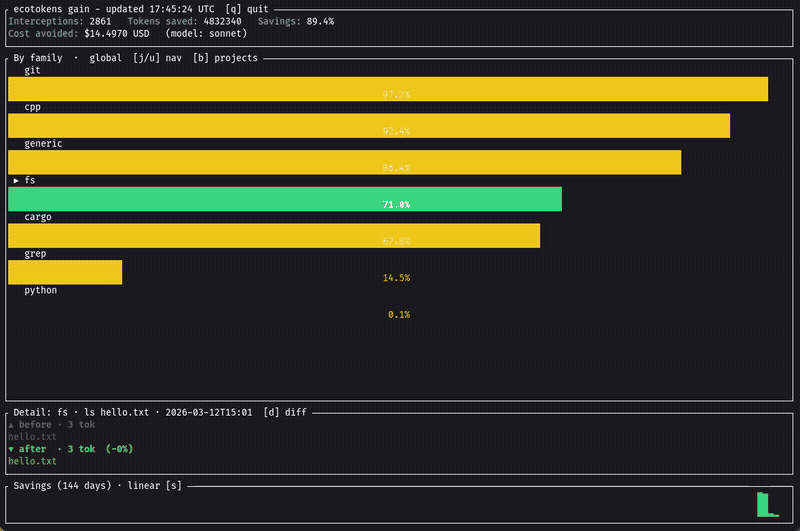

<p align="center">
  
</p>

Token-saving companion for [Claude Code](https://claude.ai/code), [Gemini CLI](https://github.com/google-gemini/gemini-cli), and [GitHub Copilot](https://github.com/features/copilot) (VS Code). ecotokens intercepts tool outputs before they reach the model, filters the noise, and records how many tokens you saved.

<p align="center">
  
</p>

## How it works

ecotokens installs as a hook that fires before every shell command. When the AI runs a shell command, ecotokens:

1. Runs the command and captures its output
2. Applies a family-specific filter (git, cargo, python, …)
3. Optionally summarizes large outputs via a local AI model (Ollama)
4. Returns the compressed output to the model
5. Records the before/after token counts in a local metrics store

Claude Code uses the `PreToolUse` hook (`~/.claude/settings.json`). Gemini CLI uses the `BeforeTool` hook (`~/.gemini/settings.json`).

For a focused view of the runtime path, see [`docs/hook-filter-metrics-flow.md`](docs/hook-filter-metrics-flow.md).

The result: the model sees clean, concise output — and you keep your context window.

## Quick install

```bash
cargo install --git https://github.com/hansipie/ecotokens
```

## Installation

### Claude Code

```bash
cargo install --path .
ecotokens install
```

### Gemini CLI

Requires [Gemini CLI](https://github.com/google-gemini/gemini-cli) ≥ 0.1.0.

```bash
cargo install --path .
ecotokens install --target gemini
```

This writes a `BeforeTool` hook entry into `~/.gemini/settings.json`.

### All targets at once

```bash
ecotokens install --target all
```

`--target all` covers Claude Code and Gemini CLI in a single command.

### With AI summarization

Enable AI-powered output compression via Ollama at install time:

```bash
ecotokens install --ai-summary                          # use default model (llama3.2:3b)
ecotokens install --ai-summary-model qwen2.5:3b         # specify model (implies --ai-summary)
```

This writes `ai_summary_enabled` and `ai_summary_model` to `~/.config/ecotokens/config.json`. Ollama must be running and the model must be pulled (`ollama pull llama3.2:3b`).

### Uninstall

```bash
ecotokens uninstall                    # Claude Code
ecotokens uninstall --target gemini    # Gemini CLI
ecotokens uninstall --target all       # all targets
```

## Commands

| Command | Description |
|---------|-------------|
| `ecotokens install` | Install the PreToolUse hook in `~/.claude/settings.json` |
| `ecotokens uninstall` | Remove the hook |
| `ecotokens filter -- CMD [ARGS]` | Run a command, filter its output, record metrics |
| `ecotokens gain` | Interactive TUI dashboard — savings by family or project |
| `ecotokens gain --json` | JSON report |
| `ecotokens config` | Show current configuration |
| `ecotokens index [--path DIR]` | Index a codebase for BM25 + symbolic search |
| `ecotokens search QUERY` | Search the indexed codebase |
| `ecotokens outline PATH` | List symbols in a file or directory |
| `ecotokens symbol ID` | Look up a symbol by its stable ID |
| `ecotokens trace callers SYMBOL` | Find callers of a symbol |
| `ecotokens trace callees SYMBOL` | Find callees of a symbol |
| `ecotokens watch [--path DIR]` | Watch a directory and keep the index up to date |
| `ecotokens duplicates` | Detect near-duplicate code blocks in the indexed codebase |

## Gain dashboard

```
ecotokens gain
ecotokens gain --period 7d
ecotokens gain --period today --model claude-sonnet-4-5
```

Interactive TUI showing token savings per command family and per project, with a sparkline.

**Keybindings:**

| Key | Action |
|-----|--------|
| `j` / `u` | Navigate up / down in list |
| `k` / `i` | Scroll history log down / up (family log view) |
| `b` | Toggle family / project view |
| `d` | Cycle detail mode (split / diff / log) — family view only |
| `s` | Cycle sparkline scale (linear / log / capped) |
| `q` / `Esc` | Quit |

## Filter command

`ecotokens filter` runs a command directly and returns its filtered output. Useful for testing filters or wrapping commands in scripts:

```bash
ecotokens filter -- cargo test
ecotokens filter --debug -- git log --oneline -50
```

The output is compressed by the same family-specific filters used by the hook, and token savings are recorded in the metrics store.

## Watch command

`ecotokens watch` monitors a directory and automatically re-indexes files as they change.

```bash
ecotokens watch                    # foreground, TUI progress
ecotokens watch --path ./src       # watch a specific directory
ecotokens watch --background       # fork to background, log to stdout
ecotokens watch --status           # show status of background process
ecotokens watch --status --json    # JSON status output
ecotokens watch --stop             # stop the background process
```

## Bonus Tools

_Less code is less tokens_

### Duplicates command

`ecotokens duplicates` scans the indexed codebase for near-identical code blocks and reports them grouped by similarity.

```bash
ecotokens duplicates                          # default: threshold=70%, min_lines=5, top_k=10
ecotokens duplicates --threshold 80           # only report ≥ 80% similarity
ecotokens duplicates --min-lines 10           # ignore blocks shorter than 10 lines
ecotokens duplicates --top-k 20              # return up to 20 groups
```

Each group shows the file paths, line ranges, similarity score, and a refactoring proposal (exact duplicate, near duplicate, or subset).

## Configuration

```bash
ecotokens config           # show all settings (text)
ecotokens config --json    # show all settings (JSON)
```

Output includes:

```
hook_installed        : true
debug                 : false
threshold_lines       : 500
threshold_bytes       : 51200
exclusions            : []
embed_provider        : ollama (http://localhost:11434)
ai_summary_enabled    : false
ai_summary_model      : llama3.2:3b (default)
```

## Supported command families

| Family | Examples |
|--------|----------|
| `git` | `git status`, `git diff`, `git log` |
| `cargo` | `cargo build`, `cargo test`, `cargo clippy` |
| `python` | `pytest`, `ruff`, `uv run` |
| `cpp` | `gcc`, `clang`, `make`, `cmake` |
| `fs` | `ls`, `find`, `tree` |
| `markdown` | `.md` files |
| `config` | `.toml`, `.json`, `.yaml` |
| `generic` | Everything else (truncated to 200 lines / 50 KB) |

## Embeddings (optional)

For semantic search, configure a local embedding provider:

```bash
# Ollama
ecotokens config --embed-provider ollama --embed-url http://localhost:11434

# LM Studio
ecotokens config --embed-provider lmstudio --embed-url http://localhost:1234

# Disable
ecotokens config --embed-provider none
```

## AI summarization (optional)

When enabled, large command outputs (> ~2500 tokens) are summarized by a local Ollama model instead of being truncated. Falls back to generic filtering if Ollama is unavailable or times out.

Enable via install:

```bash
ecotokens install --ai-summary-model llama3.2:3b
```

Or update the config file directly (`~/.config/ecotokens/config.json`):

```json
{
  "ai_summary_enabled": true,
  "ai_summary_model": "llama3.2:3b"
}
```

Ollama must be running locally. The model is called with a 3-second timeout to avoid blocking the model.

## Requirements

- Rust ≥ 1.75 (stable)
- One or more of: Claude Code (with hook support), Gemini CLI ≥ 0.1.0
- Ollama (optional, for semantic search embeddings and AI summarization)

## License

MIT
