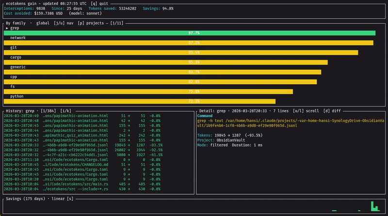

<p align="center">
  
</p>

<p align="center">
  <a href="https://github.com/hansipie/ecotokens/actions/workflows/ci.yml"></a>
  <a href="https://crates.io/crates/ecotokens"></a>
  <a href="LICENSE"></a>
</p>


# ecotokens saves real AI coding context

On one developer workstation, ecotokens recorded **19 928 hook executions** between **2026-03-06 and 2026-05-27**. The result: **94 282 087 tokens before filtering**, **5 874 896 tokens after filtering**, and **88 407 191 tokens saved**. That is a **93.8% overall reduction** across real shell commands and native tool results.

| Real-world metric | Value |
|-------------------|------:|
| Hook executions measured | 19 928 |
| Tokens saved | **88 407 191** |
| Overall reduction | **93.8%** |
| Commands with savings | 5 735 / 19 928, or 28.8% |
| Biggest command family | `grep`, with 55 383 168 tokens saved |

[Claude Code](https://claude.ai/code), Codex, [Hermes](https://hermes.dev), [Pi](https://pi.dev), [Gemini CLI](https://github.com/google-gemini/gemini-cli), and [Qwen Code](https://github.com/QwenLM/qwen-code) can all dump massive command outputs and native tool results into your context window. ecotokens sits in front of those outputs, removes the noise, preserves the important bits, and records the before/after savings locally.

Built on a *"set it and forget it!"* philosophy: one install command, zero configuration, then automatic compression for shell commands, file reads, grep/search results, directory listings, and code-intelligence workflows.

Full methodology and per-family breakdown: [`docs/BENCHMARKS.md`](docs/BENCHMARKS.md).

<p align="center">
  
</p>

## Features highlight

| Feature | Details |
|---------|---------|
| **PreToolUse hook** | Intercepts every shell (`Bash`) command before its output reaches the model - filters, compresses, and records savings |
| **PostToolUse hook** | Intercepts native tool results (`Read`/`read_file`, `Grep`/`search_file_content`, `Glob`/`list_directory`) - outline-based compression for source files, grep trimming, glob denoising |
| **Gain dashboard** | Interactive TUI - token savings by command family or project, sparkline, diff view, history log |
| **Multi-agent support** | Works with Claude Code, Codex, Hermes, Pi, Gemini CLI, and Qwen Code out of the box |
| **Precision guarantees** | Errors, failures, and stack traces are never removed; secrets are redacted before filtering |
| **Code intelligence** | BM25 + vector search (Candle zero-config or Ollama), symbol lookup, call graph tracing, near-duplicate detection |
| **MCP server** | Exposes code-intelligence tools over stdio (`ecotokens mcp-server`) and auto-registers in agent settings on install |
| **AI summarization** *(optional)* | Large outputs compressed by a local Ollama model instead of being truncated |
| **Word abbreviations** *(optional)* | Replace common words with shorter forms (`function`→`fn`, `configuration`→`config`, …) in narrative text, and nudge the model to do the same via a SessionStart instruction |
| **Model router** *(optional)* | Claude Code only: a `UserPromptSubmit` hook has Jev size each message (tiny / everyday / large / hardest) and delegates it to a helper agent on a matching model (Haiku / Sonnet / Opus / Fable), so small jobs stop running on the biggest model. Fail-open, see [Model router](#model-router-optional-off-by-default) |
| **Zero config** | One `ecotokens install` command - works automatically from there |

> Full compatibility matrix: [harness feature matrix](docs/harness-feature-matrix.md)

## How it works

ecotokens installs hooks that intercept tool outputs before they reach the model. Two interception points are supported:

**PreToolUse / BeforeTool** - fires before every shell (`Bash`) command:

1. Runs the command and captures its output
2. Applies a family-specific filter (git, cargo, python, …)
3. Optionally summarizes large outputs via a local AI model (Ollama)
4. Returns the compressed output to the model
5. Records the before/after token counts in a local metrics store

**PostToolUse / AfterTool** *(Claude Code, Gemini CLI, Qwen Code)* - fires after native file-tool calls:

1. Intercepts the tool result before it enters the context window
2. Applies a specialized filter (outline for source files, grep result trimming, glob path denoising)
3. Returns the compressed result to the model
4. Records the savings under the `native_read`, `grep`, or `fs` family

Claude Code uses the `PreToolUse` + `PostToolUse` hooks (`~/.claude/settings.json`). Codex uses `PreToolUse` + `PostToolUse` hooks in `~/.codex/hooks.json` and registers the MCP server in `~/.codex/config.toml`. Hermes uses a plugin that sends outputs through `filter-output` via `HermesTransformTerminalOutput` and `HermesTransformToolResult` hook types. Pi uses a TypeScript extension (`~/.pi/agent/extensions/ecotokens.ts`) that intercepts `tool_call` (bash pre-exec) and `tool_result` (read/grep/find/ls post-exec) events in-process. Gemini CLI uses the `BeforeTool` + `AfterTool` hooks (`~/.gemini/settings.json`). Qwen Code uses the `PreToolUse` + `PostToolUse` hooks (`~/.qwen/settings.json`).

For a focused view of the runtime path, see [`docs/hook-filter-metrics-flow.md`](docs/hook-filter-metrics-flow.md).

The result: the model sees clean, concise output - and you keep your context window.

## Quick install

```bash
cargo install --git https://github.com/hansipie/ecotokens
```

For exact token counting (tiktoken cl100k_base instead of the character heuristic):

```bash
cargo install --git https://github.com/hansipie/ecotokens --features exact-tokens
```

## Build from source

```bash
git clone https://github.com/hansipie/ecotokens.git
cd ecotokens
cargo build --release
./target/release/ecotokens --help
```

To install the locally built binary into Cargo's bin directory:

```bash
cargo install --path .
```

With exact token counting enabled via [tiktoken](https://github.com/openai/tiktoken) (cl100k_base encoding):

```bash
cargo install --path . --features exact-tokens
```
By default, token counts use a fast character heuristic (`chars × 0.25`, ~80-85% accuracy). This has no effect on filtering behavior - only the token counts recorded in metrics are more precise.

## Installation

> Ready-to-copy configuration snippets for all supported integrations: [`docs/example-configs.md`](docs/example-configs.md).

### Claude Code

```bash
cargo install --path .
ecotokens install
```

Install commands print a section per target, followed by the entries that were written:

```text
Install Claude Code
  ok      hook                   ~/.claude/settings.json
  ok      post-hook              ~/.claude/settings.json
  ok      MCP server             ~/.claude/settings.json
```

In addition to hook installation, this also registers an MCP server entry in `~/.claude/settings.json`:

```json
{
  "mcpServers": {
    "ecotokens": {
      "command": "ecotokens",
      "args": ["mcp-server"]
    }
  }
}
```

### Codex

```bash
cargo install --path .
ecotokens install --target codex
```

This installs three things:

- **Plugin** (`~/.codex/plugins/ecotokens/.codex-plugin/plugin.json`) — identifies ecotokens to Codex
- **Hooks** (`~/.codex/hooks.json`) — `PreToolUse` (bash pre-exec filtering) and `PostToolUse` (bash post-exec filtering)
- **MCP server** (`~/.codex/config.toml`) — registers `ecotokens mcp-server` under `[mcp_servers.ecotokens]`

### Hermes

Requires [Hermes](https://hermes.dev).

```bash
cargo install --path .
ecotokens install --target hermes
```

This installs an ecotokens plugin in `~/.hermes/plugins/`. The plugin intercepts two Hermes hooks:

- `transform_terminal_output` — filters raw terminal output before Hermes truncates it
- `transform_tool_result` — filters non-terminal tool results (`read_file`, `search_files`, `browser_snapshot`, MCP tools, etc.)

Each hook calls `ecotokens filter-output` as a subprocess with the appropriate `--hook-type`, so savings are tracked separately in `ecotokens gain`.

**Enabling the plugin** — Hermes requires explicit activation. Two options:

```bash
# Option A: via Hermes CLI (requires hermes to be installed and in PATH)
hermes plugins enable ecotokens

# Option B: write directly to ~/.hermes/config.yaml (no hermes CLI needed)
ecotokens install --target hermes --enable-plugin
```

`--enable-plugin` adds `ecotokens` to `plugins.enabled` in `~/.hermes/config.yaml`, creating the file if it does not exist and preserving all existing keys. Restart Hermes after enabling.

**Per-tool filtering** — tool result labels (`hermes-tool:<name>`) are mapped to the appropriate filter family automatically:

| Tool | Family | Filter applied |
|------|--------|---------------|
| `read_file`, `list_directory`, `create_file` | `fs` | file listing compaction |
| `search_files`, `find_files`, `search_in_file` | `grep` | match deduplication |
| `browser_snapshot`, `web_fetch`, `web_search` | `network` | HTML/JSON reduction |
| `run_python_code`, `execute_python` | `python` | traceback extraction |
| `delegate_task`, MCP tools, others | `generic` | 200-line / 50 KB cap |

**Runtime variables** — the generated plugin reads these from the environment:

| Variable | Default | Effect |
|----------|---------|--------|
| `ECOTOKENS_BIN` | path at install time | Override the ecotokens binary called by the plugin |
| `ECOTOKENS_HERMES_MIN_CHARS` | `2000` | Skip filtering outputs shorter than this |
| `ECOTOKENS_HERMES_TIMEOUT` | `10` | Subprocess timeout in seconds |

The plugin is fail-open: any error, timeout, or empty output returns the original content unchanged.

### Pi

Requires [Pi](https://pi.dev) (`@mariozechner/pi-coding-agent` ≥ 0.62.0).

```bash
cargo install --path .
ecotokens install --target pi
```

This writes a TypeScript extension to `~/.pi/agent/extensions/ecotokens.ts`. Pi auto-discovers it on next startup (or `/reload` inside an active session). The extension intercepts bash commands before execution and filters native tool results (`read`, `grep`, `find`, `ls`) after execution.

### Gemini CLI

Requires [Gemini CLI](https://github.com/google-gemini/gemini-cli) ≥ 0.1.0.

```bash
cargo install --path .
ecotokens install --target gemini
```

This writes `BeforeTool` and `AfterTool` hook entries into `~/.gemini/settings.json`. The `AfterTool` hook intercepts `read_file`, `search_file_content`, and `list_directory` results.

It also registers the ecotokens MCP server in `~/.gemini/settings.json`.

### Qwen Code

Requires [Qwen Code](https://github.com/QwenLM/qwen-code).

```bash
cargo install --path .
ecotokens install --target qwen
```

This writes `PreToolUse` and `PostToolUse` hook entries into `~/.qwen/settings.json`. The `PostToolUse` hook intercepts `read_file`, `search_files`, and `list_dir` results.

It also registers the ecotokens MCP server in `~/.qwen/settings.json`.

### All targets at once

```bash
ecotokens install --target all
```

`--target all` covers Claude Code, Codex, Hermes, Pi, Gemini CLI, and Qwen Code in a single command.

### With AI summarization

Enable AI-powered output compression via Ollama at install time:

```bash
ecotokens install --ai-summary                          # use default model (llama3.2:3b)
ecotokens install --ai-summary-model qwen2.5:3b         # specify model (implies --ai-summary)
```

This writes `ai_summary_enabled` and `ai_summary_model` to `~/.config/ecotokens/config.json`. Ollama must be running and the model must be pulled (`ollama pull llama3.2:3b`).

### Uninstall

```bash
ecotokens uninstall                    # Claude Code
ecotokens uninstall --target codex     # Codex
ecotokens uninstall --target hermes    # Hermes
ecotokens uninstall --target pi        # Pi
ecotokens uninstall --target gemini    # Gemini CLI
ecotokens uninstall --target qwen      # Qwen Code
ecotokens uninstall --target all       # all targets
```

Uninstall commands use the same grouped output and only list entries that were present:

```text
Uninstall Claude Code
  removed hook                   ~/.claude/settings.json
  removed post-hook              ~/.claude/settings.json
  removed MCP server             ~/.claude/settings.json
```

If nothing is installed for the selected target, the command prints:

```text
Uninstall Claude Code
  note    nothing to uninstall
```

## Commands

| Command | Description |
|---------|-------------|
| `ecotokens install` | Install the PreToolUse + PostToolUse hooks and register the MCP server entry in `~/.claude/settings.json` |
| `ecotokens install --target codex` | Install the Codex plugin, `PreToolUse`/`PostToolUse` hooks in `~/.codex/hooks.json`, and MCP server in `~/.codex/config.toml` |
| `ecotokens install --target hermes` | Install the Hermes plugin in `~/.hermes/plugins/` |
| `ecotokens install --target hermes --enable-plugin` | Install and add to `plugins.enabled` in `~/.hermes/config.yaml` directly |
| `ecotokens uninstall` | Remove all hooks (PreToolUse, PostToolUse, SessionStart, SessionEnd where supported) and the MCP server entry |
| `ecotokens filter -- CMD [ARGS]` | Run a command, filter its output, record metrics |
| `ecotokens filter --cwd DIR -- CMD [ARGS]` | Same, with an explicit working directory |
| `ecotokens filter-output --command LABEL --exit-code N` | Filter captured output read from stdin and record metrics (used by Hermes hooks) |
| `ecotokens filter-output ... --hook-type transform-tool-result` | Same, attributed to the `transform_tool_result` hook in metrics |
| `ecotokens hook-post` | PostToolUse handler - intercept native tool results (Read, Grep, Glob) |
| `ecotokens hook-prompt` | UserPromptSubmit handler - size the message and route it to a helper agent (used by the router hook, not run by hand) |
| `ecotokens gain` | Interactive TUI dashboard - savings by family or project |
| `ecotokens gain --period PERIOD` | Filter TUI to a time window (`all`, `today`, `week`, `month`) |
| `ecotokens gain --history` | Print a savings summary table for 24h / 7 days / 30 days |
| `ecotokens gain --json` | JSON report |
| `ecotokens jev [--period PERIOD] [--json]` | TUI with detailed Jev usage - calls, fallbacks, latency, tokens, cost, recent calls (also `v` in `gain`) |
| `ecotokens game [--period PERIOD]` | Space Invaders mini-game - filtered commands spawn enemies scaled by tokens saved |
| `ecotokens config [--debug true\|false]` | Show or update global configuration (including debug mode) |
| `ecotokens doctor [--json]` | Diagnose PATH, config, hook, MCP, and metrics setup without mutating files |
| `ecotokens gain price --input X --output Y` | Set the model price in USD per million tokens, used for the cost avoided figure of `gain` (cost stays `n/a` until set) |
| `ecotokens config --embed-provider candle\|ollama\|none` | Set the embedding backend (`candle` = local BERT, `ollama` = Ollama HTTP API, `none` = BM25 only) |
| `ecotokens config --embed-model MODEL` | Set the embedding model (e.g. `qwen3-embedding:latest` for Ollama, or a HuggingFace ID for Candle) |
| `ecotokens config --embed-url URL` | Set the Ollama base URL (default: `http://localhost:11434`) |
| `ecotokens config --jev true\|false` | Enable or disable TypeSafe Jev judgments (requires `TYPESAFE_API_KEY`) |
| `ecotokens config --jev-line-select true\|false` | Enable or disable Jev line selection in the generic filter |
| `ecotokens index [--path DIR]` | Index a codebase for BM25 + symbolic search |
| `ecotokens search QUERY [--context N] [--include GLOB] [--exclude GLOB] [--no-trace]` | Search the indexed codebase with line numbers, context, and optional trace augmentation |
| `ecotokens outline PATH` | List symbols in a file or directory |
| `ecotokens symbol ID` | Look up a symbol by its stable ID |
| `ecotokens trace callers SYMBOL` | Find callers of a symbol |
| `ecotokens trace callees SYMBOL` | Find callees of a symbol |
| `ecotokens watch [--path DIR]` | Watch a directory and keep the index up to date |
| `ecotokens mcp-server [--index-dir DIR]` | Start the stdio MCP server exposing search/outline/symbol/trace/duplicates tools |
| `ecotokens auto-watch enable` | Start watch automatically on each Claude Code, Codex, Hermes, Pi or Qwen Code session |
| `ecotokens auto-watch disable` | Disable automatic watch |
| `ecotokens abbreviations enable` | Replace common words with abbreviations in filtered outputs + inject a matching instruction at SessionStart |
| `ecotokens abbreviations disable` | Turn abbreviations off (default) |
| `ecotokens abbreviations list` | List the active dictionary (defaults merged with user overrides) |
| `ecotokens duplicates` | Detect near-duplicate code blocks in the indexed codebase |
| `ecotokens clear --all` | Delete all recorded interceptions |
| `ecotokens clear --before DATE` | Delete interceptions recorded before DATE (YYYY-MM-DD) |
| `ecotokens clear --older-than DURATION` | Delete interceptions older than a duration (e.g. `30d`, `2w`, `1m`) |
| `ecotokens clear --family FAMILY` | Delete interceptions of a specific command family |
| `ecotokens clear --project PATH` | Delete interceptions for a specific project (use `"[undefined]"` for entries without a git root) |
| `ecotokens completions SHELL` | Generate a shell completion script (`bash`, `zsh`, `fish`, `powershell`, `elvish`) |
| `ecotokens rewrite --mode MODE [--to TARGET]` | Paraphrase, retone, adjust reading level, or translate text using a local model |
| `ecotokens router on [--timeout-ms N]` | Turn the model router on: `UserPromptSubmit` hook plus `router-*` helper agents in `~/.claude` (Claude Code only, needs `TYPESAFE_API_KEY`) |
| `ecotokens router off` | Turn the router off and remove its hook and helper agents |
| `ecotokens router status [--json]` | Messages per size and decision, Jev requests, tokens, latency and estimated cost |
| `ecotokens router try MESSAGE... [--json] [--timeout-ms N]` | Size sample messages with Jev (live, not recorded, works while the router is off) |
| `ecotokens router price --input USD --output USD` | Set the Jev price per million tokens used for cost estimates |

## Shell completions

```bash
# zsh
ecotokens completions zsh > ~/.zsh/completions/_ecotokens

# bash
ecotokens completions bash > ~/.local/share/bash-completion/completions/ecotokens

# fish
ecotokens completions fish > ~/.config/fish/completions/ecotokens.fish

# PowerShell
ecotokens completions powershell >> $PROFILE
```

`ecotokens install` installs or updates the completion script for your current shell automatically (user-level XDG paths; for zsh, add `~/.local/share/zsh/site-functions` to `fpath`), and `ecotokens uninstall` removes it. Only bash, zsh and fish are installed automatically; use `ecotokens completions elvish|powershell` for the others. Enumerated values such as `rewrite --mode` and `config --embed-provider` are completed too.

The scripts are written to these locations:

| Shell | Path |
|-------|------|
| bash | `$XDG_DATA_HOME/bash-completion/completions/ecotokens` |
| zsh | `$XDG_DATA_HOME/zsh/site-functions/_ecotokens` |
| fish | `$XDG_CONFIG_HOME/fish/completions/ecotokens.fish` |

`$XDG_DATA_HOME` defaults to `~/.local/share` and `$XDG_CONFIG_HOME` to `~/.config`. Re-running `install` is idempotent, and `uninstall` removes the script for every supported shell. If the script cannot be written, `install` prints a warning and carries on: the failure does not abort the installation.

Reload your shell (or open a new terminal) to activate completions.

## Gain dashboard

```
ecotokens gain                                          # all time
ecotokens gain --period today                           # today only
ecotokens gain --period week                            # last 7 days
ecotokens gain --period month                           # last 30 days
ecotokens gain --history                                # summary table: 24h / 7d / 30d
ecotokens gain --history --json                         # same, as JSON
```

Cost avoided is computed from the input price you set with `ecotokens gain price --input <USD per 1M tokens> --output <USD per 1M tokens>`. Without a price it shows `n/a` (`null` in `--json`). Running `ecotokens gain price` with no flag shows the current values.

Interactive TUI showing token savings per command family and per project, with a sparkline. The `--period` flag filters both the stats and the history panels. All terminal views (gain, jev, game, outline, trace, watch) are described in [`docs/TUI.md`](docs/TUI.md).

**Keybindings:**

| Key | Action |
|-----|--------|
| `j` / `u` | Navigate up / down in list |
| `k` / `i` | Scroll history log down / up (family log view) |
| `l` / `o` | Scroll detail / diff / SplitRaw BEFORE panel down / up |
| `L` / `O` | Scroll SplitRaw AFTER panel down / up |
| `p` | Switch to project view (from family view) |
| `f` | Switch to family view (from project view) |
| `d` | Cycle detail mode (details → diff → split raw) - family view only |
| `s` | Cycle sparkline scale (linear / log / capped) |
| `q` / `Esc` | Quit |

## Filter command

`ecotokens filter` runs a command directly and returns its filtered output. Useful for testing filters or wrapping commands in scripts:

```bash
ecotokens filter -- cargo test
ecotokens filter --debug -- git log --oneline -50
ecotokens filter --cwd /path/to/project -- cargo test
```

The output is compressed by the same family-specific filters used by the hook, and token savings are recorded in the metrics store.

## Watch command

`ecotokens watch` monitors a directory and automatically re-indexes files as they change.

```bash
ecotokens watch                    # foreground, TUI progress
ecotokens watch --path ./src       # watch a specific directory
ecotokens watch --background       # fork to background
ecotokens watch --status           # show status of background process
ecotokens watch --status --json    # JSON status output
ecotokens watch --stop             # stop the background process
```

> **Note:** Background logs are only written if global `debug` is enabled (`ecotokens config --debug true`).

### Auto-watch *(Claude Code, Codex, Hermes, Pi, Qwen Code)*

`ecotokens auto-watch` integrates with agent session lifecycles to start and stop the watcher automatically where both lifecycle events are available.

```bash
ecotokens auto-watch enable    # enable auto-watch
ecotokens auto-watch disable   # disable (hooks remain installed but are no-ops)
```

When enabled, `ecotokens watch --background` starts automatically when a session opens, and stops when it closes on agents that expose an end-of-session event. The setting is stored in `~/.config/ecotokens/config.json` (`auto_watch: true/false`).

Support by agent:

| Agent | Mechanism | Notes |
|-------|-----------|-------|
| Claude Code | `SessionStart` / `SessionEnd` shell hooks in `~/.claude/settings.json` | Installed by `auto-watch enable` |
| Codex | — | Session hooks not yet supported; auto-watch not available for Codex |
| Hermes | `on_session_start` / `on_session_end` plugin hooks | Built into the Hermes plugin; install first with `ecotokens install --target hermes` |
| Pi | `session_start` / `session_end` events in the TypeScript extension | Built into the Pi extension |
| Qwen Code | `SessionStart` / `SessionEnd` shell hooks in `~/.qwen/settings.json` | Installed automatically if Qwen hook is present |
| Gemini CLI | — | Gemini does not expose session lifecycle hooks |

## Word abbreviations

```bash
ecotokens abbreviations enable    # transform narrative text + inject model instruction
ecotokens abbreviations list      # show the active dictionary
ecotokens abbreviations disable   # back to default
```

When enabled, a post-processing pass replaces full words with shorter forms in the narrative parts of tool outputs (code blocks between triple backticks are preserved). A matching `additionalContext` payload is emitted at `SessionStart` so the model adopts the same abbreviations in its own responses.

See the full list of default abbreviations in [docs/abbreviations.md](docs/abbreviations.md).

Keep the feature flag in `~/.config/ecotokens/config.json`

```json
{
  "abbreviations_enabled": true
}
```

... and put custom pairs in a separate `~/.config/ecotokens/abbreviations.json` file:

```json
{
  "function": "func",
  "repository": "repo"
}
```

## Bonus Tools

### MCP server (Claude Code, Codex, Gemini CLI, Qwen Code)

`ecotokens mcp-server` starts a stdio MCP server backed by the ecotokens index and trace engines.

```bash
ecotokens mcp-server
ecotokens mcp-server --index-dir ~/.config/ecotokens/index
```

Exposed tools:

- `ecotokens_search` - BM25 + semantic search
- `ecotokens_outline` - symbol outline for file/directory
- `ecotokens_symbol` - fetch full symbol source by stable ID
- `ecotokens_trace_callers` - find callers of a symbol
- `ecotokens_trace_callees` - find callees (with depth)
- `ecotokens_duplicates` - detect near-duplicate code blocks
- `ecotokens_rewrite` - paraphrase, retone, or translate a block of prose using a local model

For Claude Code, Codex, Gemini CLI, and Qwen Code, `ecotokens install` registers this server automatically in each target's settings file (`mcpServers` in JSON settings, `[mcp_servers.ecotokens]` in Codex's `config.toml`).

### Search command

`ecotokens search QUERY` performs BM25 (+ optional semantic) search over the indexed codebase and returns results anchored to the matching line.

```bash
ecotokens search "embed_text"                        # top 5 results, 2 lines of context
ecotokens search "embed_text" --context 4            # 4 lines above and below the match
ecotokens search "error" --include "*.rs"            # Rust files only
ecotokens search "TODO" --exclude "*.md" --exclude "*.toml"
ecotokens search "find_callers" --no-trace           # pure BM25, no trace augmentation
ecotokens search "find_callers" --json               # JSON output with callers array
ecotokens search "query" --top-k 10                  # more results
```

Output format:

```
src/search/query.rs:29 (score: 11.068)
  27:  
  28:  pub fn search_index(opts: SearchOptions) -> tantivy::Result<Vec<SearchResult>> {
  29:      let index = Index::open_in_dir(&opts.index_dir)?;
  30:      let (_, file_path_field, content_field, kind_field, line_start_field, _) = build_schema();
  31:  
```

When the query matches a symbol name, callers are automatically appended:

```
# Symbol match - call sites via trace
  src/main.rs:1301 [caller]  cmd_search
```

Results are automatically scoped to the current git project when using the global index - files from other indexed projects are silently filtered out.

### Duplicates command

_Less code is less tokens_

`ecotokens duplicates` scans the indexed codebase for near-identical code blocks and reports them grouped by similarity.

```bash
ecotokens duplicates                          # default: threshold=70%, min_lines=5
ecotokens duplicates --threshold 80           # only report ≥ 80% similarity
ecotokens duplicates --min-lines 10           # ignore blocks shorter than 10 lines
ecotokens duplicates --json                   # JSON output
```

Each group shows the file paths, line ranges, similarity score, and a refactoring proposal (exact duplicate, near duplicate, or subset).

### Game command

`ecotokens game` turns your token savings into a Space Invaders mini-game. Every filtered command spawns an enemy whose strength scales with the tokens it saved.

```bash
ecotokens game                    # spawn enemies from all recorded commands
ecotokens game --period today     # only spawn enemies from today's commands
```

Commands present at startup form the classic marching formation; commands filtered live while the game is running spawn as free-roaming "snakes". Arrow keys move, space fires.

## Configuration

```bash
ecotokens config           # show all settings (text)
ecotokens config --json    # show all settings (JSON)
```

Output includes:

```bash
hook_installed        : true
debug                 : false
debuglog              : false
price_input_usd_per_mtok  : unset
price_output_usd_per_mtok : unset
exclusions            : []
embed_provider        : candle model=sentence-transformers/all-MiniLM-L6-v2
ai_summary_enabled    : false
ai_summary_model      : llama3.2:3b (default)
ai_summary_url        : http://localhost:11434 (default)
abbreviations_enabled : false
```

### Debug mode

Enable the global debug mode to see detailed interception logs and enable background logging for the `watch` command:

```bash
ecotokens config --debug true
ecotokens config --debug false
```

This updates the `debug` field in `~/.config/ecotokens/config.json`.

### Debug file logging

Enable structured per-hook logging to a file for deeper tracing of what ecotokens intercepts:

```bash
ecotokens config --debuglog true
ecotokens config --debuglog false
```

When enabled, every hook invocation appends a JSONL entry to `~/.config/ecotokens/debug.log`:

```json
{"ts":"2026-05-08T12:00:00Z","uid":"a1b2c3d4","cmd":"git status","phase":"input","data":{...}}
{"ts":"2026-05-08T12:00:00Z","uid":"a1b2c3d4","cmd":"git status","phase":"output","data":{...}}
```

Each entry contains a short `uid` to correlate the input and output phases of the same invocation. Distinct from `--debug` (which prints to stderr) - `--debuglog` writes silently to disk and survives across sessions.

Logged payloads go through the same secret masking as intercepted output, and the file is created `0600` (owner-only). It still contains file contents and command output, so review it before attaching it to a bug report.

### Price for cost calculations

`gain` has no built-in price list. Enter the price of the model you use, in USD per million tokens:

```bash
ecotokens gain price --input 3 --output 15   # set both
ecotokens gain price --input 2.5             # update only the input price
ecotokens gain price                         # show the current prices
```

The saved-token cost uses the input price. Values must be finite and non-negative. This is separate from `ecotokens router price`, which sets the Jev price.

### Word abbreviations *(optional)*

```bash
ecotokens abbreviations enable    # transform narrative text + inject model instruction
ecotokens abbreviations list      # show the active dictionary
ecotokens abbreviations disable   # back to default
```

When enabled, a post-processing pass replaces full words with shorter forms in the narrative parts of tool outputs (code blocks between triple backticks are preserved). A matching `additionalContext` payload is emitted at `SessionStart` so the model adopts the same abbreviations in its own responses.

Extend or override the built-in dictionary via a separate `~/.config/ecotokens/abbreviations.json` file:

```json
{
  "function": "func",
  "repository": "repo"
}
```

The feature flag stays in `~/.config/ecotokens/config.json`:

```json
{
  "abbreviations_enabled": true
}
```


## Supported command families

| Family | Examples |
|--------|----------|
| `git` | `git status`, `git diff`, `git log` |
| `cargo` | `cargo build`, `cargo test`, `cargo clippy` |
| `python` | `pytest`, `ruff`, `uv run`, `poetry`, `pipx` |
| `javascript` | `jest`, `mocha`, `yarn` |
| `cpp` | `gcc`, `clang`, `make`, `cmake` |
| `fs` | `ls`, `find`, `tree` |
| `markdown` | `.md` files |
| `config` | `.toml`, `.json`, `.yaml` |
| `generic` | Everything else (truncated to 200 lines / 50 KB) |
| `native_read` | Claude Code `Read` tool results (PostToolUse, outline-based compression) |

> **Note:** Family detection uses the basename of the first token, so commands invoked via absolute path (`/usr/bin/git`), venv (`.venv/bin/pytest`), version managers (`~/.cargo/bin/cargo`), or wrappers (`poetry run`) are correctly matched to their family.

Hermes tool result labels (`hermes-tool:<name>`) are mapped to the same families: `read_file` → `fs`, `search_files` → `grep`, `browser_snapshot` → `network`, `run_python_code` → `python`, everything else → `generic`.

## Embeddings

`ecotokens search` uses **dual BM25 + vector retrieval** with score fusion (`0.4 × BM25 + 0.6 × cosine`). Two embedding backends are available: the built-in Candle engine (zero-config) or an external Ollama instance.

### Provider

**Candle** (default) — runs `sentence-transformers/all-MiniLM-L6-v2` (384 dim) locally. The model is downloaded automatically from HuggingFace Hub on first use (~90 MB, cached in `~/.cache/huggingface/`).

```bash
# Candle is active by default - nothing to configure
ecotokens index --path /your/project
ecotokens search "your query"
```

**Ollama** — delegates embedding to a running Ollama instance. Supports any Ollama embedding model, including large-dimension models like `qwen3-embedding:latest` (2560 dim).

```bash
# Switch to Ollama with qwen3-embedding (Ollama must be running)
ecotokens config --embed-provider ollama --embed-model qwen3-embedding:latest

# Custom URL (default: http://localhost:11434)
ecotokens config --embed-provider ollama \
  --embed-url http://localhost:11434 \
  --embed-model qwen3-embedding:latest

# Change just the model without touching the provider
ecotokens config --embed-model nomic-embed-text

# Revert to Candle
ecotokens config --embed-provider candle
```

> When switching between providers (or between models with different output dimensions), `ecotokens index` automatically detects the change and rebuilds the vector index.

Each result includes a `retrieval_source` field (`bm25`, `vector`, or `both`) visible in JSON output.

### Disable embeddings

```bash
ecotokens config --embed-provider none    # fall back to pure BM25
```

### Workflow

```bash
# 1. Index your project (Candle embeddings computed automatically)
ecotokens index --path /your/project

# 2. Search with hybrid scoring
ecotokens search "your query"

# 3. JSON output with retrieval_source
ecotokens search "your query" --json
```

### Model change detection

When the configured embedding model changes, `ecotokens index` automatically rebuilds the vector index (`hnsw_index.bin`) without touching the BM25 index. Embeddings for unchanged files are reused between runs.

## AI summarization (optional)

When enabled, large command outputs (> ~2500 tokens) are summarized by a local Ollama model instead of being truncated. Falls back to generic filtering if Ollama is unavailable or times out.

Enable via install:

```bash
ecotokens install --ai-summary-model llama3.2:3b
```

Or update the config file directly (`~/.config/ecotokens/config.json`):

```json
{
  "ai_summary_enabled": true,
  "ai_summary_model": "llama3.2:3b"
}
```

Ollama must be running locally. The model is called with a 3-second timeout to avoid blocking the model.

## Rewrite (local text transformation)

`ecotokens rewrite` paraphrases, retones, adjusts reading level, or translates prose using your
already-configured local model - entirely on your machine, with zero API cost. It's not a token
*saving* feature (it transforms text rather than compressing it, and is excluded from savings
reporting), but it reuses the same local-model plumbing as AI summarization.

```bash
echo "Please fix the login bug ASAP, it's blocking everyone." | ecotokens rewrite --mode tone --to formal
ecotokens rewrite --mode reading-level --to grade-8 --file notes.md
ecotokens rewrite --mode translate --to fr --file notes.md
echo "$TEXT" | ecotokens rewrite --mode paraphrase --json
```

| Mode | `--to` | Notes |
|------|--------|-------|
| `paraphrase` | forbidden | Rewords while preserving meaning |
| `tone` | required, free-form | e.g. `plain`, `formal`, `friendly` |
| `reading-level` | required, free-form | e.g. `grade-8`, `expert` |
| `translate` | required, language code/name | e.g. `fr`, `french`; a same-language target is a no-op |

Fenced code, inline code, URLs, emails, numbers, and dates in the input are preserved
byte-identically. Code-shaped or predominantly non-prose input is refused rather than transformed.
On any model failure (unreachable, timeout, empty/truncated/corrupted response), the command
**fails open**: it prints the original input unchanged and still exits `0`, so it's always safe to
drop into a pipeline. Long documents are split on structure-aware boundaries (paragraphs, then
sentences, then whitespace - never inside a fenced code block, table, or list) and reassembled;
if any chunk fails, the whole document falls back untouched rather than emitting a partial mix.

Available identically from the CLI, as the `ecotokens_rewrite` MCP tool (agents can call it
mid-session), and - opt-in only - as an automatic pipeline stage (see below).

### Diff audit trail (optional)

Every transformation can be saved as a masked unified diff, so changes stay reviewable:

```bash
echo "$TEXT" | ecotokens rewrite --mode paraphrase --save-diff   # force on for one run
echo "$TEXT" | ecotokens rewrite --mode paraphrase --no-save-diff  # force off, overrides config
```

Diffs go to `rewrite_diff_dir` (default: OS temp dir), are `0600`-permissioned, existing secret
patterns are masked on both sides before diffing, and old diffs are pruned to `rewrite_diff_retention`
(default 50, `0` disables pruning). Off by default. A write failure never blocks the transformed
output - it just warns on stderr.

### Automatic pipeline transformation (optional, off by default)

With `rewrite_auto_enabled = true`, qualifying prose flowing through the normal filter pipeline is
rewritten automatically before being handed to the agent - e.g. auto-translating command output.
This is the one rewrite setting that adds latency to every qualifying interception, so it's
deliberately off by default and gated behind several safeguards: only content classified as prose
is touched (code, stack traces, diffs, and structured data always pass through untouched), content
carrying a masked secret is never sent to the model, short content below `rewrite_auto_min_tokens`
is skipped, and the stage has its own stricter timeout (`rewrite_auto_timeout_ms`) separate from
`rewrite_timeout_ms`. Because rewriting can *expand* text where compression only shrinks it, any
resulting token cost is tracked separately and shown as `rewrite_overhead_tokens` in `ecotokens gain`
and `ecotokens gain --json` - never hidden inside the normal savings figures.

### Configuration

Update `~/.config/ecotokens/config.json` directly, or pass `--model`/`--save-diff`/`--no-save-diff`
per invocation:

```json
{
  "rewrite_model": "llama3.2:3b",
  "rewrite_url": "http://localhost:11434",
  "rewrite_timeout_ms": 30000,
  "rewrite_context_tokens": 8192,
  "rewrite_truncation_ratio": 0.5,
  "rewrite_save_diff": false,
  "rewrite_diff_dir": null,
  "rewrite_diff_retention": 50,
  "rewrite_auto_enabled": false,
  "rewrite_auto_mode": "translate",
  "rewrite_auto_target": "fr",
  "rewrite_auto_min_tokens": 500,
  "rewrite_auto_timeout_ms": 2000
}
```

`rewrite_model` falls back to `ai_summary_model`, then to `llama3.2:3b`, and `rewrite_url` must
resolve to localhost - the endpoint is validated before any request is issued, and text is never
transmitted anywhere else unless you opt in to [Jev judgments](#jev-judgments-optional-off-by-default).

## Jev judgments (optional, off by default)

ecotokens can ask [TypeSafe](https://docs.typesafe.ai)'s Jev model for quick typed judgments
(about 100 ms each) in the places where it otherwise relies on hand-tuned heuristics:

| Where | What Jev decides | Built-in fallback |
|-------|------------------|-------------------|
| Rewrite gate | prose / code / stack trace / structured data / mixed, plus the source language for `translate` (one request) | regex and ratio classifier, stopword language detection |
| Rewrite output check | is the output faithful to the input, in the target language, and is its first or last line model commentary (in any language)? | token-ratio truncation check, English-only preamble regex |
| Generic filter (`jev_line_select_enabled`) | which lines between the kept head and tail report failures, errors, or identifiers you need | blind head+tail truncation |

**Every judgment falls back to today's behaviour.** If Jev is disabled, has no key, is unreachable,
times out, returns an error, or a response is missing an answer, the built-in heuristic runs
exactly as before. After the first transport failure, Jev is skipped for the rest of the process
and a single warning goes to stderr. Exact signals (valid JSON, diffs, Python tracebacks, Rust
panics) are never sent to Jev. The structural rewrite checks (empty or truncated response, sentinel
integrity) always run.

**Privacy.** Enabling Jev sends excerpts of the text being judged to `api.typesafe.ai`. Every
string is passed through the secret-masking patterns first, and each request is capped at
`jev_max_input_chars`. The API key is read **only** from the `TYPESAFE_API_KEY` environment
variable. It is never stored in `config.json` or printed. `ecotokens doctor` shows whether Jev is
active.

```bash
export TYPESAFE_API_KEY=...
```

Instead of exporting it in your shell (hooks may not inherit it), you can put it in
`~/.config/ecotokens/.env`, a `KEY=VALUE` file loaded at every ecotokens start. Variables already set
in the real environment take precedence. Keep the file private (`chmod 600`).

```
TYPESAFE_API_KEY=...
```

```json
{
  "jev_enabled": true,
  "jev_url": "https://api.typesafe.ai/v1/systemone",
  "jev_timeout_ms": 1000,
  "jev_max_input_chars": 32000,
  "jev_line_select_enabled": false,
  "jev_prose_min_prob": 0.9,
  "jev_code_min_prob": 0.8,
  "jev_language_min_confidence": 0.8,
  "jev_verify_fail_below": 0.3,
  "jev_commentary_min_prob": 0.8,
  "jev_line_keep_min_prob": 0.05
}
```

Diagrams and details of each integration point: [`docs/jev-integration.md`](docs/jev-integration.md).

`jev_line_select_enabled` is a separate opt-in because generic-filter line selection runs on the
interception path and adds one request to large generic outputs (up to 10 windows of 200 lines;
anything larger keeps plain head+tail truncation). `jev_url` must use https. Build with
`--no-default-features` and without the `jev` feature to compile Jev out entirely.

## Model router (optional, off by default)

The router has Jev size up every message you send to Claude Code, so small jobs run on a smaller,
cheaper model instead of the biggest one. It needs `TYPESAFE_API_KEY` (see
[Jev judgments](#jev-judgments-optional-off-by-default)), but it does not need `jev_enabled`.

```bash
ecotokens router on          # hook + helper agents, then restart Claude Code
ecotokens router status      # messages per size, decisions, Jev tokens and cost
ecotokens router off         # removes the hook and the helper agents
ecotokens router try "rename foo to bar" "write a launch post"   # live check, not recorded
```

| Size | For | Helper agent | Model |
|------|-----|--------------|-------|
| tiny | a lookup, a rename, a one-line answer | `router-tiny` | Haiku |
| everyday | a normal email, post or short document | `router-everyday` | Sonnet |
| large | a multi-step build, research, a full report | `router-large` | Opus |
| hardest | strategy, or anything where a wrong call is expensive | `router-hardest` | Fable |

Claude Code cannot switch the main session's model for each message, so the router works through a
`UserPromptSubmit` hook. The hook asks Jev one question (which size is the smallest that can do
this job well?) and, in the same request, whether the message is a short reply that only makes
sense inside the conversation. When Jev is at least 60% sure, and the message is not such a
reply, the hook tells the main session to hand the job to that size's helper agent and relay the
answer. Each helper ends its reply with one line naming the model that did the work. The main
model still reads the message and does the handoff, so the saving is on the work itself.

The router never blocks a message. If it is off, has no key, times out, or anything goes wrong,
the hook prints nothing and the message goes through untouched. After a timeout or a network
failure, Jev is not asked again for 5 minutes. Jev currently answers in about 2 to 3 seconds, and
every message waits up to `router_timeout_ms` (default 800 ms). Set it with
`ecotokens router on --timeout-ms 3000` if you accept that delay in exchange for routing. See
[docs/model-router.md](docs/model-router.md) for the details.

**Privacy.** While the router is on, every message you type is sent (masked) to TypeSafe to be
sized. Keep it off for private work.

## Benchmarks

Measured on a real developer workstation from 2026-03-06 to 2026-05-27 (19 928 hook executions):

| Metric | Value |
|--------|------:|
| Tokens before filtering | 94 282 087 |
| Tokens after filtering | 5 874 896 |
| Tokens saved | **88 407 191** |
| Overall reduction | **93.8 %** |
| Commands with savings | 5 735 / 19 928, or 28.8 % |
| Biggest family | `grep`, 55 383 168 tokens saved |
| Best single run | 11 323 890 tokens saved from one `grep` scan |

[Full benchmark report](docs/BENCHMARKS.md)

## Precision Guarantees

Filtering is aggressive on noise, conservative on signal:

- **Short outputs are never modified** - outputs under 200 lines or 50 KB pass through unchanged
- **Errors are always preserved** - `error[`, `FAILED`, `E   ` (pytest), `--- FAIL:` (Go), stack traces and panic messages are never removed
- **Failure sections are fully kept** - structured blocks (`=== FAILURES ===`, `failures:`, failure diffs) are always passed through in their entirety
- **Conservative fallback** - if a family filter doesn't improve the output (filtered ≥ original), the original is returned as-is
- **Secrets are redacted before filtering** - 33 patterns covering cloud keys, AI APIs, VCS tokens, payment secrets and more are detected and replaced before any content reaches the model. See [`docs/secret-patterns.md`](docs/secret-patterns.md) for the full list.
- **UTF-8 safe truncation** - truncation always happens at character boundaries, never mid-codepoint
- **Head + tail preservation** - when generic truncation applies, the first and last 20 lines are always kept (start context + end result)

## Requirements

- Rust ≥ 1.75 (stable)
- One or more of: Claude Code (with hook support), Codex, Hermes, Pi ≥ 0.62.0, Gemini CLI ≥ 0.1.0, Qwen Code
- Internet access on first use (Candle downloads `all-MiniLM-L6-v2` ~90 MB from HuggingFace Hub; cached locally after that)
- Ollama (optional, for AI summarization and/or Ollama-backed embeddings)

## Contributing

Contributions are welcome! Please read the [contributing guidelines](docs/CONTRIBUTING.md) before submitting a pull request.

## License

MIT
