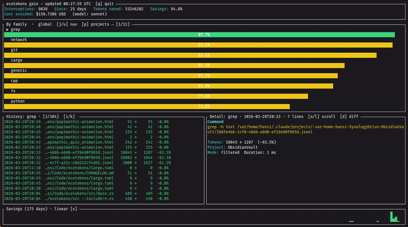

<p align="center">
  
</p>

<p align="center">
  <a href="https://github.com/hansipie/ecotokens/actions/workflows/ci.yml"></a>
  <a href="https://crates.io/crates/ecotokens"></a>
  <a href="LICENSE"></a>
</p>


# ecotokens saves real AI coding context

On one developer workstation, ecotokens recorded **19 928 hook executions** between **2026-03-06 and 2026-05-27**. The result: **94 282 087 tokens before filtering**, **5 874 896 tokens after filtering**, and **88 407 191 tokens saved**. That is a **93.8% overall reduction** across real shell commands and native tool results.

| Real-world metric | Value |
|-------------------|------:|
| Hook executions measured | 19 928 |
| Tokens saved | **88 407 191** |
| Overall reduction | **93.8%** |
| Commands with savings | 5 735 / 19 928, or 28.8% |
| Biggest command family | `grep`, with 55 383 168 tokens saved |

[Claude Code](https://claude.ai/code), Codex, [Hermes](https://hermes.dev), [Pi](https://pi.dev), [Gemini CLI](https://github.com/google-gemini/gemini-cli), [Qwen Code](https://github.com/QwenLM/qwen-code), and [OpenCode](https://opencode.ai) can all dump massive command outputs and native tool results into your context window. ecotokens sits in front of those outputs, removes the noise, preserves the important bits, and records the before/after savings locally.

Built on a *"set it and forget it!"* philosophy: one install command, zero configuration, then automatic compression for shell commands, file reads, grep/search results, directory listings, and code-intelligence workflows.

Full methodology and per-family breakdown: [`docs/BENCHMARKS.md`](docs/BENCHMARKS.md).

<p align="center">
  
</p>

## Features highlight

| Feature | Details |
|---------|---------|
| **PreToolUse hook** | Intercepts every shell (`Bash`) command before its output reaches the model - filters, compresses, and records savings |
| **PostToolUse hook** | Intercepts native tool results (`Read`/`read_file`, `Grep`/`search_file_content`, `Glob`/`list_directory`) - outline-based compression for source files, grep trimming, glob denoising |
| **Gain dashboard** | Interactive TUI - token savings by command family or project, sparkline, diff view, history log |
| **Multi-agent support** | Works with Claude Code, Codex, Hermes, Pi, Gemini CLI, Qwen Code, and OpenCode out of the box |
| **Precision guarantees** | Errors, failures, and stack traces are never removed; secrets are redacted before filtering |
| **Code intelligence** | BM25 + vector search (Candle zero-config or Ollama), symbol lookup, call graph tracing, near-duplicate detection |
| **MCP server** | Exposes code-intelligence tools over stdio (`ecotokens mcp-server`) and auto-registers in agent settings on install |
| **AI summarization** *(optional)* | Large outputs compressed by a local Ollama model instead of being truncated |
| **Word abbreviations** *(optional)* | Replace common words with shorter forms (`function`→`fn`, `configuration`→`config`, …) in narrative text, and nudge the model to do the same via a SessionStart instruction |
| **Model router** *(optional)* | Claude Code only: a `UserPromptSubmit` hook has Jev size each message (tiny / everyday / large / hardest) and delegates it to a helper agent on a matching model (Haiku / Sonnet / Opus / Fable), so small jobs stop running on the biggest model. Fail-open, see [Model router](docs/model-router.md) |
| **Session handoff** *(optional)* | Claude Code only: `/handoff` saves the objective, key files, failed attempts and next steps of a long session; after `/clear` (or a compaction) a `SessionStart` hook loads them back. Local, secrets masked, fail-open, see [Session handoff](docs/handoff.md) |
| **Zero config** | One `ecotokens install` command - works automatically from there |

> Full compatibility matrix: [harness feature matrix](docs/harness-feature-matrix.md)

## How it works

ecotokens installs hooks that intercept tool outputs before they reach the model. Two interception points are supported:

**PreToolUse / BeforeTool** - fires before every shell (`Bash`) command:

1. Runs the command and captures its output
2. Applies a family-specific filter (git, cargo, python, …)
3. Optionally summarizes large outputs via a local AI model (Ollama)
4. Returns the compressed output to the model
5. Records the before/after token counts in a local metrics store

**PostToolUse / AfterTool** *(Claude Code, Gemini CLI, Qwen Code)* - fires after native file-tool calls:

1. Intercepts the tool result before it enters the context window
2. Applies a specialized filter (outline for source files, grep result trimming, glob path denoising)
3. Returns the compressed result to the model
4. Records the savings under the `native_read`, `grep`, or `fs` family

Per-agent wiring is described in [`docs/installation.md`](docs/installation.md#how-each-agent-is-wired). For a focused view of the runtime path, see [`docs/hook-filter-metrics-flow.md`](docs/hook-filter-metrics-flow.md).

The result: the model sees clean, concise output - and you keep your context window.

## Quick install

```bash
cargo install --git https://github.com/hansipie/ecotokens
```

Or via [mise](https://mise.jdx.dev):

```bash
mise use github:hansipie/ecotokens
```

For exact token counting (tiktoken cl100k_base instead of the character heuristic):

```bash
cargo install --git https://github.com/hansipie/ecotokens --features exact-tokens
```

## Get started

Install the hooks for your agent, restart it, and you are done:

| Agent | Command |
|-------|---------|
| Claude Code | `ecotokens install` |
| Codex | `ecotokens install --target codex` |
| Hermes | `ecotokens install --target hermes --enable-plugin` |
| Pi | `ecotokens install --target pi` |
| OpenCode | `ecotokens install --target opencode` |
| Gemini CLI | `ecotokens install --target gemini` |
| Qwen Code | `ecotokens install --target qwen` |
| All of the above | `ecotokens install --target all` |

Then check that everything is wired, and see what you save:

```bash
ecotokens doctor    # diagnose PATH, config, hooks and MCP setup (changes nothing)
ecotokens gain      # interactive savings dashboard
```

To remove ecotokens, run `ecotokens uninstall` (same `--target` values). Per-agent details, the Hermes plugin
activation, and other install options are in [`docs/installation.md`](docs/installation.md); ready-to-copy
configuration snippets are in [`docs/example-configs.md`](docs/example-configs.md).

## Everyday commands

| Command | What it does |
|---------|--------------|
| `ecotokens gain` | Savings dashboard (`--period today\|week\|month`, `--history`, `--json`) |
| `ecotokens filter -- CMD [ARGS]` | Run a command and print its filtered output |
| `ecotokens show ID` | Print the full output behind a filtered result (see below) |
| `ecotokens search QUERY` | Search the indexed codebase (run `ecotokens index` first) |
| `ecotokens config` | Show the current settings |
| `ecotokens clear --older-than 30d` | Delete old recorded interceptions |
| `ecotokens doctor` | Diagnose the setup |

The complete list, with shell completions, is in [`docs/commands.md`](docs/commands.md).

## Recovering the full output

Filtering keeps errors and key lines, but sometimes you need everything. When filtering saves at least 20% of the
tokens, ecotokens saves the full output and appends a hint:

```text
[ecotokens] Full output saved: ecotokens show 3fa9c1d2
```

```bash
ecotokens show 3fa9c1d2   # print the saved output
```

Only the **secret-masked** text is stored (`~/.config/ecotokens/raw/`, mode `0600`), so recovery never exposes a secret
that filtering hid. Entries are deleted after 7 days or beyond the 200 newest, and `ecotokens clear --all` removes them
too. Retention and an off switch (`raw_recovery_enabled`) are in `config.json`; see
[docs/raw-output-recovery.md](docs/raw-output-recovery.md) for details and limits.

## Precision Guarantees

Filtering is aggressive on noise, conservative on signal:

- **Short outputs are never modified** - outputs under 200 lines or 50 KB pass through unchanged
- **Errors are always preserved** - `error[`, `FAILED`, `E   ` (pytest), `--- FAIL:` (Go), stack traces and panic messages are never removed
- **Failure sections are fully kept** - structured blocks (`=== FAILURES ===`, `failures:`, failure diffs) are always passed through in their entirety
- **Conservative fallback** - if a family filter doesn't improve the output (filtered ≥ original), the original is returned as-is
- **Secrets are redacted before filtering** - 33 patterns covering cloud keys, AI APIs, VCS tokens, payment secrets and more are detected and replaced before any content reaches the model. See [`docs/secret-patterns.md`](docs/secret-patterns.md) for the full list.
- **UTF-8 safe truncation** - truncation always happens at character boundaries, never mid-codepoint
- **Head + tail preservation** - when generic truncation applies, the first and last 20 lines are always kept (start context + end result)

## Optional features

Everything below is **off by default**. Core filtering needs none of it.

| Feature | Runs | Details |
|---------|------|---------|
| AI summarization, text rewrite | Locally, with Ollama | [`docs/local-models.md`](docs/local-models.md) |
| Vector search (embeddings) | Locally (Candle by default, or Ollama) | [`docs/code-intelligence.md`](docs/code-intelligence.md) |
| Word abbreviations | Locally | [`docs/configuration.md`](docs/configuration.md) |
| Jev judgments | **Sends masked excerpts to TypeSafe** (`api.typesafe.ai`) | [`docs/jev-integration.md`](docs/jev-integration.md) |
| Model router (Claude Code) | **Sends every message you type, masked, to TypeSafe** | [`docs/model-router.md`](docs/model-router.md) |

Jev and the router need a [TypeSafe](https://docs.typesafe.ai) key in the `TYPESAFE_API_KEY` environment variable.
Without it, or if the service is unreachable, ecotokens falls back to its built-in heuristics and never blocks a
command or a message.

## Documentation

| Topic | Where |
|-------|-------|
| Per-agent setup, build from source, uninstall | [`docs/installation.md`](docs/installation.md) |
| Every command, shell completions, gain dashboard | [`docs/commands.md`](docs/commands.md) |
| Settings, debug logging, cost price, abbreviations | [`docs/configuration.md`](docs/configuration.md) |
| Command families and their filters | [`docs/filters.md`](docs/filters.md) |
| Search, embeddings, watch, duplicates, MCP tools | [`docs/code-intelligence.md`](docs/code-intelligence.md), [`docs/mcp-server.md`](docs/mcp-server.md) |
| AI summarization and text rewrite (local Ollama) | [`docs/local-models.md`](docs/local-models.md) |
| Jev judgments (TypeSafe, optional) | [`docs/jev-integration.md`](docs/jev-integration.md) |
| Model router (Claude Code, optional) | [`docs/model-router.md`](docs/model-router.md) |
| Session handoff (Claude Code, optional) | [`docs/handoff.md`](docs/handoff.md) |
| Recovering the full output | [`docs/raw-output-recovery.md`](docs/raw-output-recovery.md) |
| Terminal views (gain, jev, game, outline, trace, watch) | [`docs/TUI.md`](docs/TUI.md) |
| Word abbreviations | [`docs/abbreviations.md`](docs/abbreviations.md), [`docs/abbreviations-pipeline.md`](docs/abbreviations-pipeline.md) |
| Agent compatibility matrix | [`docs/harness-feature-matrix.md`](docs/harness-feature-matrix.md) |
| Secret patterns that are masked | [`docs/secret-patterns.md`](docs/secret-patterns.md) |
| Runtime path of a filtered command | [`docs/hook-filter-metrics-flow.md`](docs/hook-filter-metrics-flow.md) |
| Benchmarks | [`docs/BENCHMARKS.md`](docs/BENCHMARKS.md) |
| Test plan and release checklist | [`docs/TEST-PLAN.md`](docs/TEST-PLAN.md) |

## Requirements

- Rust ≥ 1.75 (stable)
- One or more of: Claude Code (with hook support), Codex, Hermes, Pi ≥ 0.62.0, Gemini CLI ≥ 0.1.0, Qwen Code, OpenCode
- Internet access on first use (Candle downloads `all-MiniLM-L6-v2` ~90 MB from HuggingFace Hub; cached locally after that)
- Ollama (optional, for AI summarization and/or Ollama-backed embeddings)
- A [TypeSafe](https://docs.typesafe.ai) API key in the `TYPESAFE_API_KEY` environment variable (optional, for [Jev judgments](docs/jev-integration.md) and the [model router](docs/model-router.md)); without it, every Jev use falls back to the existing heuristic

## Contributing

Contributions are welcome! Please read the [contributing guidelines](docs/CONTRIBUTING.md) before submitting a pull request.

## License

MIT
