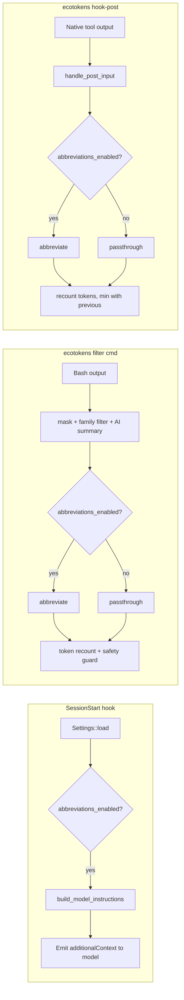

# Abbreviations pipeline

This document describes **where and when** the word-abbreviations feature kicks in inside the ecotokens runtime. Companion to [`hook-filter-metrics-flow.md`](./hook-filter-metrics-flow.md), which covers the broader hook → filter → metrics path.

The feature has one goal: **shave extra tokens off both directions of the AI ↔ tool exchange**, by replacing common long words with short forms (e.g. `configuration` → `config`, `repository` → `repo`, `function` → `fn`).

## Overview



Three independent trigger points share the same module (`src/abbreviations`) and the same configuration flag, but run at different moments:

| Trigger | When | Direction | Purpose |
|---------|------|-----------|---------|
| `SessionStart` | session bootstrap | model output | tell the model to abbreviate too |
| `filter` cmd | after each intercepted bash call | tool output | shrink raw stdout |
| `hook-post` | after each native tool call (Read/Grep/Glob) | tool output | shrink Claude's native tool results |

## Activation

Two files in `~/.config/ecotokens/`:

- `config.json` — holds the boolean flag:
  ```json
  { "abbreviations_enabled": true }
  ```
- `abbreviations.json` — optional, holds custom pairs that extend or override the defaults:
  ```json
  { "function": "func", "repository": "repo" }
  ```

The feature is **off by default**. Enable via:

```bash
ecotokens abbreviations enable
ecotokens abbreviations list      # inspect the active dictionary
ecotokens abbreviations disable
```

The split between the two files is deliberate: the flag stays close to the rest of the runtime config, while custom pairs live in their own file so the user can hand-edit them without risking JSON-syntax mistakes inside `config.json`.

## Trigger points

### 1. SessionStart — proactive instructions to the model

**Location**: `src/main.rs` (`cmd_session_start`)

When the AI CLI starts a new session, ecotokens runs as a `SessionStart` hook. If `abbreviations_enabled` is true, the handler emits a JSON response:

```json
{
  "hookSpecificOutput": {
    "hookEventName": "SessionStart",
    "additionalContext": "Token-saving directive: in your textual responses ...\n- configuration → config\n- repository → repo\n..."
  }
}
```

The body is built by `abbreviations::build_model_instructions(&settings)` and lists every active pair (defaults merged with custom). The model picks it up as system context and uses the same short forms in its own replies.

This is the **only proactive** trigger — the other two only react to data flowing back to the model.

### 2. filter cmd — bash command output

**Location**: `src/filter/mod.rs` (`run_filter_pipeline_with_cwd`)

When `ecotokens filter -- <cmd>` runs (rewritten by the `PreToolUse` hook), the captured stdout flows through this pipeline:

```text
raw stdout
  → masking (PII / secrets)
  → family-specific filter (cargo, git, cpp, ...)
  → optional AI-summary fallback
  → ABBREVIATE                ← here
  → token recount + safety guard
  → metrics record
  → return to AI
```

Abbreviation happens **last** in the content-transform chain, so it works on the already-compressed output. The safety guard right after compares `tokens_before` and `tokens_after`: if the abbreviated result would somehow be larger, ecotokens reverts to the masked-only output. This guarantees abbreviation never makes things worse.

### 3. hook-post — native tool output

**Location**: `src/hook/post_handler.rs` (`handle_post`)

The `PostToolUse` native handler (feature 008) intercepts Claude's native tools (Read, Grep, Glob, etc.). When the inner `handle_post_input` returns `PostFilterResult::Filtered`, the handler runs abbreviation on the filtered output:

```rust
let (final_output, final_tokens_after) = if settings.abbreviations_enabled {
    let abbreviated = abbreviations::abbreviate(output, &settings).0;
    let recomputed = tokens::count_tokens(&abbreviated) as u32;
    (abbreviated, recomputed.min(*tokens_after))   // never worse than before
} else {
    (output.clone(), *tokens_after)
};
```

Note the `recomputed.min(*tokens_after)` — same defensive principle as the filter cmd path: we report the better of the two counts.

`content_before` (the original snapshot stored in metrics) is **not** abbreviated — only the output that goes back to the model.

## Internals

### Dictionary

- Built-in: `DEFAULT_PAIRS` in `src/abbreviations/dictionary.rs` (41 pairs).
- Custom: `Settings::abbreviations_custom`, loaded from `~/.config/ecotokens/abbreviations.json`.
- Merge: `dictionary::merged_pairs(&custom)` returns defaults overridden by custom.

Examples from defaults:

| Word | Short form |
|------|------------|
| `configuration` | `config` |
| `repository` | `repo` |
| `function` | `fn` |
| `directory` | `dir` |
| `dependencies` | `deps` |
| `documentation` | `docs` |
| `environment` | `env` |
| `parameter` | `param` |
| `warnings` | `warns` |

### Transformation rules (`abbreviate` fn)

```rust
pub fn abbreviate(text: &str, settings: &Settings) -> (String, u32)
```

- Word boundary regex `\b<word>\b`, **case-insensitive**.
- **Code blocks preserved**: text is split on triple backticks; even-indexed segments get transformed, odd-indexed (inside ```` ``` ````) pass through verbatim.
- **Case preservation** via `apply_case`:
  - `WARNING` (all upper) → `WARN`
  - `Warning` (capital initial) → `Warn`
  - `warning` (lower) → `warn`
- Returns `(transformed_text, replacement_count)`.

### Performance

- `default_rules()` compiles the regexes once via `OnceLock`.
- When `abbreviations_custom` is non-empty, rules are recompiled per call. This is intentional (low call frequency, simple impl) — not a hot path.

## Implementation map

| Concern | File |
|---------|------|
| Module entry | `src/abbreviations/mod.rs` |
| Default pairs | `src/abbreviations/dictionary.rs` |
| Settings flag + custom file load | `src/config/settings.rs` |
| SessionStart trigger | `src/main.rs` (`cmd_session_start`) |
| filter cmd trigger | `src/filter/mod.rs` (`run_filter_pipeline_with_cwd`) |
| hook-post trigger | `src/hook/post_handler.rs` (`handle_post`) |
| CLI sub-commands | `src/main.rs` (`cmd_abbreviations_{enable,disable,list}`) |

## Notes and boundaries

- **All-or-nothing**: there is no per-command opt-out. If the flag is on, all three trigger points apply.
- **Code blocks safe**: the triple-backtick split means stdout containing source code keeps identifiers intact.
- **Identifiers and paths are NOT protected outside code blocks** — narrative prose only. The model instructions reflect this by explicitly excluding identifiers and file paths.
- **Side-effect on integration tests**: tests that assert on exact substrings of filtered output may break when abbreviations are enabled in the user's environment. Mitigation: isolate `HOME` and `XDG_CONFIG_HOME` to a temp directory in the test (no config file → flag defaults to false). See `tests/filter/cpp_test.rs::filter_command_routes_gpp_through_cpp_filter` for an example.
