# Hook → Filter → Metrics flow

This document describes the core runtime path used when ecotokens intercepts a shell command through a hook and turns the raw output into a persisted token-savings record.

ecotokens is a **CLI-only** tool. The entire integration relies on shell hooks (`PreToolUse` / `BeforeTool`) — there is no background server, no MCP server, and no persistent process to manage.

## Overview

```mermaid
flowchart LR
    A[AI CLI runs shell command] --> B[Hook handler reads JSON from stdin]
    B --> C{Excluded command?}
    C -- yes --> D[Passthrough: allow original command]
    C -- no --> E[Rewrite command to ecotokens filter -- ...]
    E --> F[ecotokens filter executes command]
    F --> G[Capture stdout and duration]
    G --> H[Mask secrets and PII]
    H --> I[Detect command family]
    I --> J[Apply family-specific filter]
    J --> K{Compression helped?}
    K -- no --> L[Optional AI summary fallback]
    K -- yes --> M[Use filtered output]
    L --> N[Estimate tokens before and after]
    M --> N
    N --> O[Build Interception record]
    O --> P[Append JSON line to metrics.jsonl]
    P --> Q[Return compressed output to the AI]
```



## Step by step

### 1. Hook intercepts the tool call

`ecotokens hook` handles Claude Code `PreToolUse` events, and `ecotokens hook-gemini` handles Gemini CLI `BeforeTool` events.

Both handlers:

- read the hook payload from `stdin`
- extract the shell command
- load `Settings`
- check the configured exclusion prefixes

If the command is excluded, the hook returns an allow response without changing the command. Otherwise it rewrites the command to:

```bash
ecotokens filter -- <original command>
```

That keeps the AI tool invocation unchanged at a high level while routing execution through ecotokens' filtering pipeline.

## 2. Filter command runs the original command

The `ecotokens filter` subcommand:

- reconstructs the original command string
- executes the underlying program with `std::process::Command`
- collects `stdout`
- forwards `stderr` directly
- measures command duration in milliseconds

It then hands the captured output to `run_filter_pipeline(...)`.

## 3. Filter pipeline transforms the output

The pipeline in `src/filter/mod.rs` has four important stages:

### 3.1 Masking

The raw output is first passed through `crate::masking::mask(...)` to redact secrets and sensitive values before any further processing or persistence.

### 3.2 Family detection

`detect_family(...)` classifies the command into a family such as `git`, `cargo`, `python`, `fs`, `js`, or `generic`.

That family selects the filter implementation that will compress the output.

### 3.3 Family-specific filtering

`apply_filter(...)` routes the masked output to the relevant filter, for example:

- `filter_git(...)`
- `filter_cargo(...)`
- `filter_python(...)`
- `filter_fs(...)`
- `filter_generic(...)`

Short outputs under 200 characters are effectively passed through after masking.

### 3.4 Optional AI-summary fallback

If the filtered output is not better than the masked output, ecotokens falls back to `ai_summary_or_fallback(...)`.

In practice this means ecotokens prefers deterministic family filters first, then only tries AI summarization when the filter does not reduce token load.

## 4. Token counts are computed

After filtering, ecotokens estimates:

- `tokens_before` from the raw output
- `tokens_after` from the final filtered output

By default this uses the project's estimated token counter (`chars * 0.25`), unless exact token counting is enabled elsewhere.

## 5. Metrics record is written

If a metrics path is available, ecotokens creates an `Interception` record and appends it as one JSON object per line to:

```text
~/.config/ecotokens/metrics.jsonl
```

The record includes:

- command string
- detected command family
- git root when available
- token counts before and after
- savings percentage
- filter mode
- redaction flag
- duration in milliseconds
- truncated before/after content snapshots

The write is append-only, which keeps metrics collection simple and resilient.

## 6. Compressed output goes back to the model

Once the metrics record is persisted, the filtered output is printed back to the caller. The AI sees the compressed result instead of the full raw command output.

## Implementation map

- Hook entry points: `src/hook/handler.rs`
- Filter pipeline: `src/filter/mod.rs`
- Metrics storage: `src/metrics/store.rs`
- CLI entry point: `src/main.rs`

## Notes and boundaries

- The hook layer decides whether to rewrite or pass through. It does not perform filtering itself.
- The filter layer owns masking, family detection, compression, token estimation, and metrics creation.
- The metrics layer is intentionally simple: append JSONL now, aggregate later when reports or TUIs read the file.
- **ecotokens ne fonctionne plus comme serveur MCP.** L'intégration se fait uniquement via les hooks shell (`PreToolUse` / `BeforeTool`). Aucun serveur n'est démarré, aucun port n'est ouvert.
