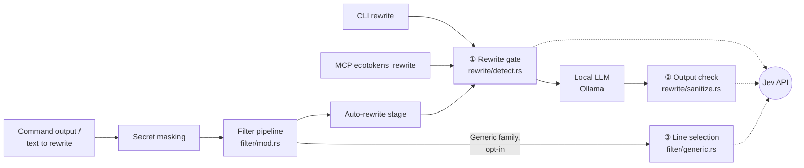
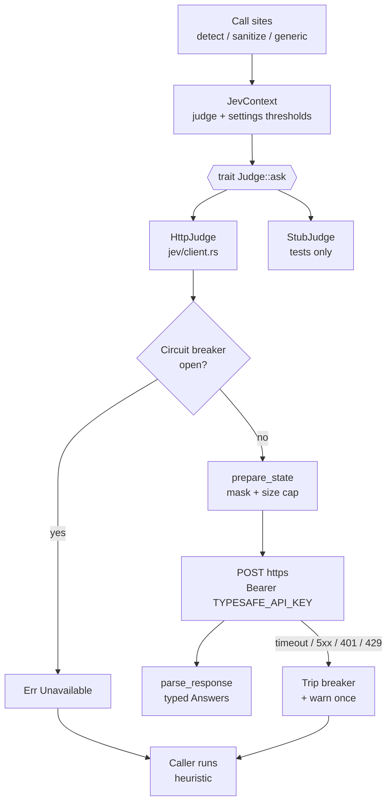
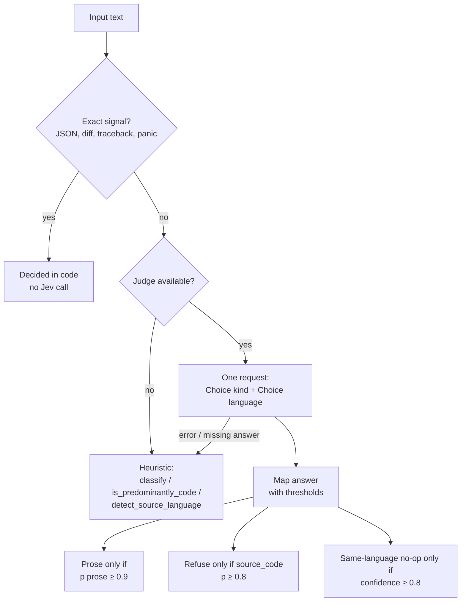
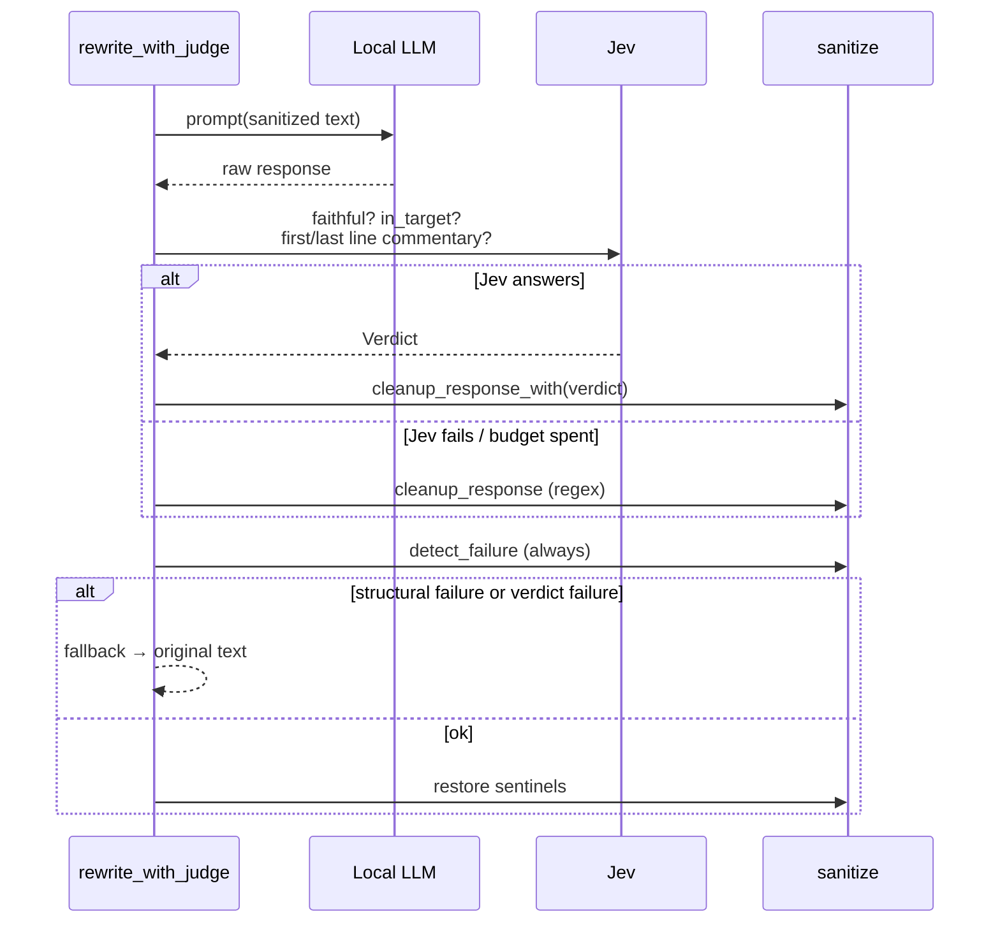
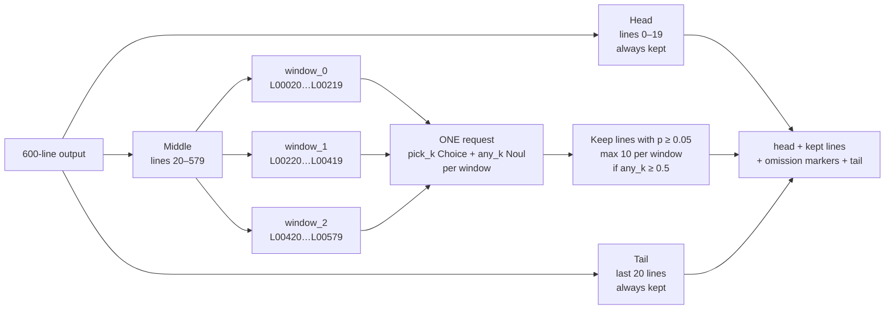
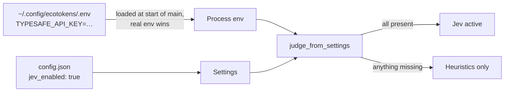

# Jev integration in ecotokens

*Last updated: 2026-09-23*

## Overview

Jev (TypeSafe's System One model) now replaces the most fragile heuristics in ecotokens in three places: the rewrite gate, rewrite output verification, and generic-filter line selection. It returns typed answers with probabilities in about 100 ms. **Every call is optional, and the existing heuristic stays as the fallback.** If Jev is disabled, has no key, is unreachable, times out, errors, or leaves an answer out, ecotokens runs exactly the code it ran before.



Dashed arrows are optional Jev calls. When a call fails, the arrow is simply skipped and the heuristic in that box decides.

| # | Where | Replaces | Jev primitive |
| --- | --- | --- | --- |
| ① | `rewrite/detect.rs` | regex/ratio classifier, stopword language detection | Choice (kind, language) |
| ② | `rewrite/sanitize.rs` | token-ratio check only, English-only preamble regex | Noul × 2–4 |
| ③ | `filter/generic.rs` | blind head+tail truncation | Choice + Noul per 200-line window |

## The `src/jev/` module

All Jev access goes through one trait, so every call site can be tested with a stub and no network.



- **`judge_from_settings`** returns `None` unless the `jev` feature is compiled in, `jev_enabled` is true, and `TYPESAFE_API_KEY` is non-empty. `None` means pure heuristics, with no request made.
- **`prepare_state`** runs `masking::mask` on every string in the request, then shrinks strings proportionally to `jev_max_input_chars`. Each string keeps a head, middle and tail sample.
- **`HttpJudge::new`** rejects any non-https URL. Its `Debug` output hides the key.
- **Circuit breaker:** after one transport failure, later calls in the same process return `Unavailable` immediately, and a single stderr warning is printed. A 422 (a problem with the request itself) does not trip it.
- **Typed getters:** `Answers::noul(id)` and `Answers::choice(id)` return `Option`, so a missing or wrong-typed answer also means "fall back".

## ① Rewrite gate — `rewrite/detect.rs`

Before any text goes to the local LLM, ecotokens must decide two things: whether the input is prose (code, traces and data must never be rewritten), and, for `translate`, whether it is already in the target language. Both used to rest on regex line counts, ratio thresholds and stopword lists. Now one Jev request answers both questions in parallel.



| Function | Used by | Question(s) | Fallback |
| --- | --- | --- | --- |
| `classify_with` | auto-rewrite stage (`filter/mod.rs`) | Choice `kind` | `classify` |
| `rewrite_gate` | `rewrite_with_judge` (CLI, MCP, auto) | Choice `kind` + Choice `language` (translate only) | `is_predominantly_code` + `detect_source_language` |

The `kind` options are `prose`, `source_code`, `stack_trace_or_error`, `structured_data` and `mixed`. The `language` options are the 28 codes of `modes::LANGUAGES` plus `mixed_or_unclear`. The thresholds lean the same way as the old code: when unsure, don't rewrite, and don't skip a translation the user asked for.

## ② Output verification — `rewrite/sanitize.rs`

Small local models fail in ways a token count cannot see. They answer the text instead of rewriting it, drift in meaning, translate into the wrong language, or wrap the result in "Voici le texte :". `judge_response` asks Jev about each model response, for the single-pass path and for every chunk of a long document.



| Question (Noul) | Asked when | Effect |
| --- | --- | --- |
| `faithful` | always | < 0.3 → fall back to the original |
| `in_target` | `translate` only | < 0.3 → fall back to the original |
| `first_line_commentary` | response has more than one line | ≥ 0.8 → strip that line |
| `last_line_commentary` | response has more than one line | ≥ 0.8 → strip that line |

The structural checks (empty or truncated response, sentinel integrity) always run, with or without Jev. The Jev timeout is capped by what remains of the rewrite's whole-operation budget. In chunked mode, an echoed style anchor is removed before judging so it doesn't read as added content.

## ③ Line selection — `filter/generic.rs`

For commands with no dedicated filter, ecotokens keeps the first 20 and last 20 lines of a large output. An error at line 300 of a 600-line log disappears, which breaks the TEST-PLAN rule that errors stay visible. With `jev_line_select_enabled`, Jev picks the lines worth keeping from the middle part, following the line-by-line search cookbook.



Example result:

```text
step 0: ok
…
step 19: ok
[ecotokens] ... 280 lines omitted (600 total, 1 kept by Jev) ...
error: connection refused while uploading artifact build-4711
[ecotokens] ... 279 lines omitted ...
step 580: ok
…
step 599: ok
```

**Plain head+tail truncation, unchanged from today, is used when:**

- the output is under the thresholds, or takes the byte-truncation path (a few huge lines)
- there are more than 10 windows (above ~2,000 lines), or more than `jev_max_input_chars` characters
- the call fails or an answer is missing
- Jev flags no line at all

The filter input is already masked, lines are clipped to 200 characters, and `apply_filter` without a judge behaves exactly as before.

## Configuration, operations and tests

### Enabling Jev



The `.env` loader (`config/env_file.rs`) matters for hooks, which don't always inherit the shell's `export`. The key is never read from `config.json` and never printed. Keep `.env` at `chmod 600`.

Toggle the two switches from the CLI instead of editing `config.json`:

```bash
ecotokens config --jev true               # jev_enabled
ecotokens config --jev-line-select true   # jev_line_select_enabled (needs jev_enabled)
```

`config` prints a warning when `TYPESAFE_API_KEY` is missing, or when line selection is enabled while `jev_enabled` is false.

| Setting | Default | Role |
| --- | --- | --- |
| `jev_enabled` | `false` | master switch for points ① and ② |
| `jev_line_select_enabled` | `false` | extra opt-in for point ③ (runs on the hook path) |
| `jev_url` | `https://api.typesafe.ai/v1/systemone` | must use https |
| `jev_timeout_ms` | `1000` | per request, capped by the caller's own remaining budget |
| `jev_max_input_chars` | `32000` | size cap on the text sent |
| `jev_prose_min_prob` | `0.9` | ① prose gate |
| `jev_code_min_prob` | `0.8` | ① code refusal |
| `jev_language_min_confidence` | `0.8` | ① same-language no-op |
| `jev_verify_fail_below` | `0.3` | ② faithfulness and target language |
| `jev_commentary_min_prob` | `0.8` | ② commentary strip |
| `jev_line_keep_min_prob` | `0.05` | ③ line keep |

`ecotokens doctor` shows a **Jev** line: disabled, enabled without a key (warning), or enabled. It makes no network call.

### Tests

| File | Covers |
| --- | --- |
| `tests/jev/client_test.rs` | request shape, response parsing, masking, size cap, https check, key hidden in debug output, breaker rules, doctor |
| `tests/jev/detect_jev_test.rs` | kind mapping, thresholds, no Jev call on exact signals, fallback equals heuristic |
| `tests/integration/rewrite_jev_test.rs` | faithful / unfaithful / wrong language / French commentary / same-language no-op / failure equals `rewrite()` |
| `tests/filter/generic_jev_test.rs` | mid-log error kept, one request, byte-identical fallback |
| `tests/config/env_file_test.rs` | `.env` parsing and precedence |
| `tests/integration/jev_live_test.rs` | `#[ignore]`, real API, for calibrating thresholds |

### Known limitations

- **Breaker lifetime:** the breaker lasts only as long as one process. Each hook call is a new process, so while TypeSafe is down every hooked command using ① (auto stage) or ③ can wait up to `jev_timeout_ms`. A short-lived on-disk "Jev down" marker would fix this.
- **Thresholds:** the defaults have not yet been calibrated against the live model.
- **Privacy:** with Jev enabled, masked excerpts leave the machine. That departs from ecotokens' local-only default, so both switches stay off by default.
