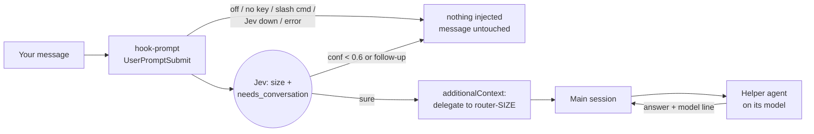

# Model router

*Last updated: 2026-09-23*

## What it does

The router has Jev (TypeSafe) size up every message sent to Claude Code, so small jobs run on a smaller, cheaper model. It is **off by default**, and `ecotokens router on` / `off` turn it on and off.

Claude Code cannot switch the main session's model for each message, and a hook cannot change it either. The closest thing that works is a `UserPromptSubmit` hook that tells the main session which helper agent should do the job:



| Size | Jev criterion | Agent | `model:` |
| --- | --- | --- | --- |
| tiny | a quick lookup, a rename, a factual question or a one-line answer | `router-tiny` | haiku |
| everyday | a normal email, a social post, a short document, a simple explanation or a small self-contained code change | `router-everyday` | sonnet |
| large | a multi-step build, research, a full report, or code changes across several files | `router-large` | opus |
| hardest | strategy, architecture, high-stakes decisions, or anything where a wrong call is expensive | `router-hardest` | fable |

### What it cannot do

- The main model still reads every message and does the handoff, so it saves on the work itself, not on the whole turn.
- A helper starts cold, without the conversation. The injected instruction asks the main session to pass along the context the helper needs.
- The `large → opus` size saves nothing when the main session also runs Opus. It only moves the work into its own agent context.
- The hook runs before the message is sent, so Jev's latency adds to every message. See the next section.

## Latency

Measured on 2026-09-23 against `api.typesafe.ai`, most calls took 1.9 to 2.8 s from the server, which is well above the ~100 ms described elsewhere. A few took about 0.45 s, and one returned HTTP 520 after 5 s. With the default `router_timeout_ms` of 800 ms, most messages time out. The first timeout pauses Jev for 5 minutes, so the router mostly stays out of the way and does not route. To actually route, accept the delay:

```bash
ecotokens router on --timeout-ms 3000
```

Claude Code's own hook timeout is set to `ceil(router_timeout_ms / 1000) + 1` seconds as a hard stop.

## Live check (2026-09-23, `router try --timeout-ms 15000`)

| Message | Size | Confidence | Follow-up | Decision |
| --- | --- | --- | --- | --- |
| what's the capital of Australia? | tiny | 1.00 | 0.01 | delegated |
| rename the variable usr to user in this line: … | tiny | 0.99 | 0.06 | delegated |
| write a short email declining a meeting on Thursday | everyday | 0.95 | 0.04 | delegated |
| draft a LinkedIn post announcing our v0.26 release | everyday | 1.00 | 0.05 | delegated |
| build a CLI tool that syncs two folders, with tests and a README | large | 0.99 | 0.03 | delegated |
| research SQLite WAL tuning and write a full report with benchmarks | large | 1.00 | 0.03 | delegated |
| should we pivot ecotokens to a paid SaaS? weigh the risks … | hardest | 0.90 | 0.08 | delegated |
| design a zero-downtime migration strategy for our production Postgres database | hardest | 0.99 | 0.02 | delegated |
| yes do that but make it shorter | everyday | 0.37 | 0.95 | self_followup |
| ok go with the second one | tiny | 0.93 | 0.98 | self_followup |

Each request used about 555 input and 66 output tokens.

## Commands and settings

| Command | Effect |
| --- | --- |
| `ecotokens router on [--timeout-ms N]` | sets `router_enabled`, installs the hook in `~/.claude/settings.json`, writes the four agents to `~/.claude/agents/` |
| `ecotokens router off` | clears the flag, removes the hook entry and the agents ecotokens wrote |
| `ecotokens router status [--json]` | per-size and per-decision counts, Jev requests, tokens, average latency, cost |
| `ecotokens router try MSG… [--json] [--timeout-ms N]` | sizes messages live without recording them, even while the router is off |
| `ecotokens router price --input X --output Y` | Jev price in USD per million tokens. TypeSafe publishes none, so cost stays blank until you set one. Separate from `ecotokens gain price` |

| Setting | Default | Role |
| --- | --- | --- |
| `router_enabled` | `false` | master switch |
| `router_timeout_ms` | `800` | maximum time Jev may add to a message |
| `router_min_confidence` | `0.6` | below this, the main session keeps the message |
| `router_followup_min_prob` | `0.5` | at or above this, the message is treated as a follow-up and kept |
| `jev_usd_per_mtok_input` / `_output` | unset | cost estimate |

The router uses `TYPESAFE_API_KEY`, `jev_url` and `jev_max_input_chars`, but not `jev_enabled`, so turning it on does not turn on the other Jev uses.

## Safety

- Messages are masked (`prepare_state`) and size-capped before they are sent. Decisions are logged in `~/.config/ecotokens/router.db` without the message text.
- Only agent files containing the `managed by ecotokens router` marker are ever written or removed. A user file with the same name is kept, and `router on` warns about it.
- Install and uninstall of the hook are idempotent and keep third-party `UserPromptSubmit` entries. `ecotokens uninstall` removes the hook and the agents too.
- **Privacy:** while the router is on, every message is sent (masked) to TypeSafe. Keep it off for private work.
